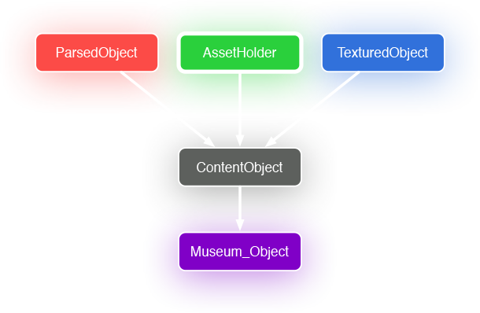
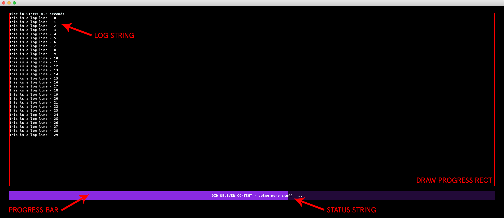
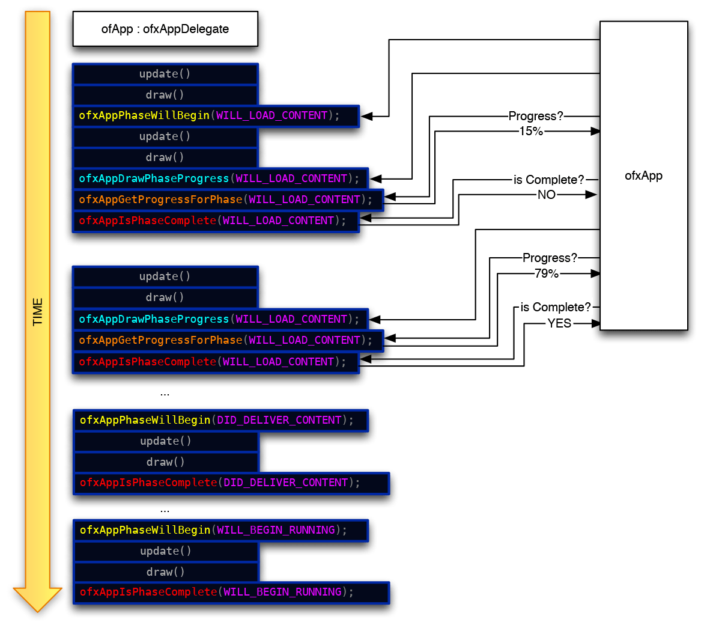
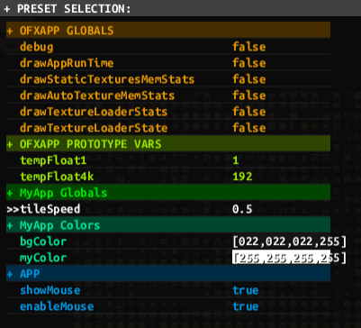
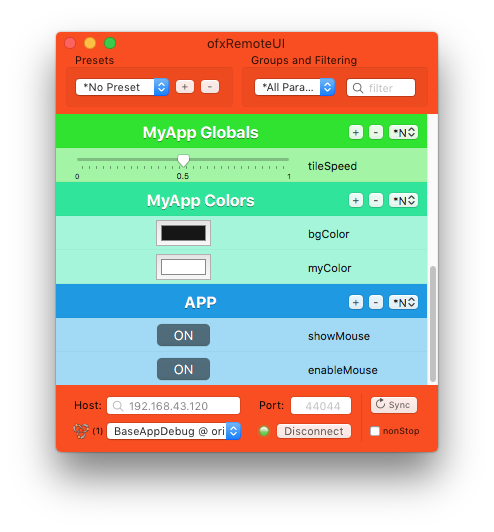
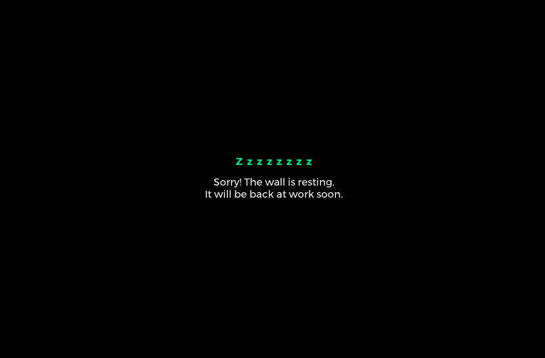
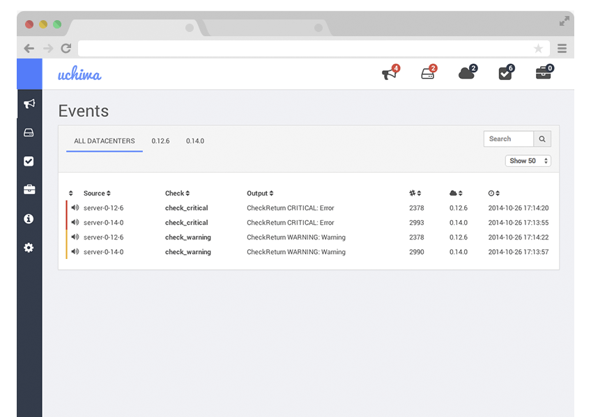
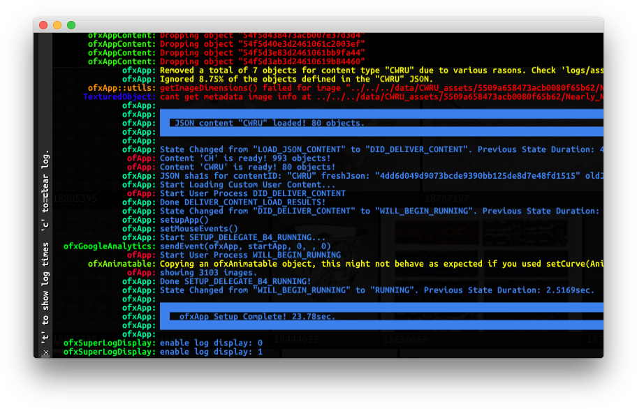

# ofxApp
[](https://travis-ci.org/local-projects/ofxApp)
[](https://ci.appveyor.com/project/armadillu/ofxapp/branch/master)

What is _ofxApp_? Its a basic skeleton for an interactive CMS-driven installation made in [OpenFrameworks](http://openframeworks.cc). It tries to simplify your life by offering some basic common functionality required by most projects, trying to minimize the effort required on your side to get an installation up and running.

[](https://www.youtube.com/watch?v=vQaj6wCZZqs "ofxApp Startup")

There are also some (slightly outdated) [Slides](https://github.com/local-projects/ofxApp/raw/master/introduction.pdf) that might help you understand what _ofxApp_ offers and how it works internally.

---
# Table of Contents
<!-- TOC depthFrom:1 depthTo:6 withLinks:1 updateOnSave:1 orderedList:0 -->

- [ofxApp](#ofxapp)
- [Table of Contents](#table-of-contents)
	- [0. Feature List](#0-feature-list)
	- [1. How To Use](#1-how-to-use)
		- [1.1 Setup a project with all the required addons](#11-setup-a-project-with-all-the-required-addons)
		- [1.2 Define Pre-Processor macro with your project name](#12-define-pre-processor-macro-with-your-project-name)
		- [1.3 Create files for your Global Variables & Global Colors](#13-create-files-for-your-global-variables-global-colors)
		- [1.4 Make your ofApp class a subclass of ofxAppDelegate](#14-make-your-ofapp-class-a-subclass-of-ofxappdelegate)
	- [2. ofxApp Functionality Coverage](#2-ofxapp-functionality-coverage)
		- [2.1 The Configuration File - "ofxAppSettings.json"](#21-the-configuration-file-ofxappsettingsjson)
		- [2.2 ofxApp and Content](#22-ofxapp-and-content)
			- [2.2.1 How does ofxApp Handle Content?](#221-how-does-ofxapp-handle-content)
			- [2.2.2 The Content JSON file structure](#222-the-content-json-file-structure)
			- [2.2.3 ofxApp Content Abstraction](#223-ofxapp-content-abstraction)
			- [2.2.4 Content Sources](#224-content-sources)
			- [2.2.5 Content Ingestion and Texture Loading Setup](#225-content-ingestion-and-texture-loading-setup)
			- [2.2.5.1 std::function<void (ofxMtJsonParserThread::JsonStructureData &)> pointToObjects;](#2251-stdfunctionvoid-ofxmtjsonparserthreadjsonstructuredata-pointtoobjects)
			- [2.2.5.2 std::function<void (ofxMtJsonParserThread::SingleObjectParseData &)> parseOneObject;](#2252-stdfunctionvoid-ofxmtjsonparserthreadsingleobjectparsedata-parseoneobject)
			- [2.2.5.3 std::function<void (ofxApp::CatalogAssetsData & data)> defineObjectAssets;](#2253-stdfunctionvoid-ofxappcatalogassetsdata-data-defineobjectassets)
			- [2.2.5.4 std::function<void (ContentObject*)> setupTexturedObject;](#2254-stdfunctionvoid-contentobject-setuptexturedobject)
			- [2.2.5.5 Content Use Policies](#2255-content-use-policies)
			- [2.2.6 Content Fail and Recovery](#226-content-fail-and-recovery)
		- [2.3 ofxApp Startup & Init stages](#23-ofxapp-startup-init-stages)
		- [2.4 Static Textures loading Automation](#24-static-textures-loading-automation)
		- [2.5 Fonts](#25-fonts)
		- [2.6 Globals and Parameter Tweaking](#26-globals-and-parameter-tweaking)
			- [2.6.1 Globals File](#261-globals-file)
			- [2.6.2 Global Colors File](#262-global-colors-file)
			- [2.6.3 Tweaking parameters with ofxRemoteUI](#263-tweaking-parameters-with-ofxremoteui)
		- [2.7 Dynamic Texture Loading](#27-dynamic-texture-loading)
		- [2.8 Maintenance Mode](#28-maintenance-mode)
		- [2.9 Error Handling](#29-error-handling)
			- [2.9.1 On Screen Error](#291-on-screen-error)
			- [2.9.1 Terminate with Error](#291-terminate-with-error)
		- [2.10 CMS Error Reporting](#210-cms-error-reporting)
		- [2.11 Analytics](#211-analytics)
		- [2.12 PID file](#212-pid-file)
		- [2.13 Logging](#213-logging)
		- [2.14 TUIO - Multitouch Events](#214-tuio-multitouch-events)
		- [2.15 Http Downloads](#215-http-downloads)
		- [2.16 Time Profiling](#216-time-profiling)
- [Appendix](#appendix)
		- [ofxApp Keyboard Commands](#ofxapp-keyboard-commands)
		- [ofxApp MACROS](#ofxapp-macros)
		- [Knowns Issues / Future Developments](#knowns-issues-future-developments)
		- [Included Libraries / assets](#included-libraries-assets)
		- [License](#license)

<!-- /TOC -->
## 0. Feature List

A quick summary of the features offered by _ofxApp_:

 * Startup / Loading Screen split up in user manageable phases with on screen progress ([ofxStateMachine](https://github.com/armadillu/ofxStateMachine))
 * CMS Asset download/cache/checksum management ([ofxSimpleHttp](https://github.com/armadillu/ofxSimpleHttp), [ofxAssets](https://github.com/armadillu/ofxAssets), [ofxTagSystem](https://github.com/armadillu/ofxTagSystem))
 * CMS JSON content loading & failover recovery ([ofxJSON](https://github.com/local-projects/ofxJSON), [ofxMTJsonParser](https://github.com/armadillu/ofxMTJsonParser))
 * CPU & GPU profiler ([ofxTimeMeasurements](https://github.com/armadillu/ofxTimeMeasurements))
 * Dynamic texture load / unload ([ofxTexturedObject](https://github.com/armadillu/ofxTexturedObject), [ofxProgressiveTextureLoad](https://github.com/armadillu/ofxProgressiveTextureLoad))
 * Logging to console, file & screen (interactive) ([ofxSuperLog](https://github.com/armadillu/ofxSuperLog), [ofxThreadSafeLog](https://github.com/armadillu/ofxThreadSafeLog))
 * Parameter Tweaking ([ofxRemoteUI](https://github.com/armadillu/ofxRemoteUI))
 * Error Reporting to CMS ([ofxSensu](https://github.com/local-projects/ofxSensu))
 * Static Texture Assets preloading + access by fileName + live edits ([ofxAutoTexture](https://github.com/armadillu/ofxAutoTexture))
 * Analytics ([ofxGoogleAnalytics](https://github.com/armadillu/ofxGoogleAnalytics))
 * Font rendering ([ofxFontStash](https://github.com/armadillu/ofxFontStash), [ofxFontStash2](https://github.com/armadillu/ofxFontStash2))
 * Multitouch setup ([ofxTuio](https://github.com/local-projects/ofxTuio))
 * Screen Management (fullscreen, windows, etc) ([ofxScreenSetup](https://github.com/armadillu/ofxScreenSetup))
 * All the behaviours highly configurable from a single config file ([ofxJsonSettings](https://github.com/loca-projects/ofxJsonSettings))

## 1. How To Use

### 1.1 Setup a project with all the required addons

ofxOSC, ofxXmlSettings, ofxOpenCV, ofxNetwork, ofxPoco,  [ofxFontStash](https://github.com/armadillu/ofxFontStash), [ofxFontStash2](https://github.com/armadillu/ofxFontStash2), [ofxTuio](https://github.com/local-projects/ofxTuio), [ofxJSON](https://github.com/local-projects/ofxJSON), [ofxSuperLog](https://github.com/armadillu/ofxSuperLog), [ofxAutoTexture](https://github.com/armadillu/ofxAutoTexture), [ofxMTJsonParser](https://github.com/armadillu/ofxMTJsonParser), [ofxSimpleHttp](https://github.com/armadillu/ofxSimpleHttp), [ofxTagSystem](https://github.com/armadillu/ofxTagSystem), [ofxStateMachine](https://github.com/armadillu/ofxStateMachine), [ofxAssets](https://github.com/armadillu/ofxAssets), [ofxThreadSafeLog](https://github.com/armadillu/ofxThreadSafeLog), [ofxProgressiveTextureLoad](https://github.com/armadillu/ofxProgressiveTextureLoad), [ofxTexturedObject](https://github.com/armadillu/ofxTexturedObject), [ofxMullion](https://github.com/armadillu/ofxMullion), [ofxSensu](https://github.com/local-projects/ofxSensu),  [ofxGoogleAnalytics](https://github.com/armadillu/ofxGoogleAnalytics), [ofxJsonSettings](https://github.com/loca-projects/ofxJsonSettings), [ofxTimeMeasurements](https://github.com/armadillu/ofxTimeMeasurements), [ofxRemoteUI](https://github.com/armadillu/ofxRemoteUI), [ofxHistoryPlot](https://github.com/armadillu/ofxHistoryPlot), [ofxScreenSetup](https://github.com/armadillu/ofxScreenSetup), [ofxInterface](http://github.com/local-projects/ofxInterface), [ofxLibwebsockets](http://github.com/local-projects/ofxLibwebsockets), [ofxApp*](https://github.com/local-projects/ofxApp).

To do so, given the high number of addon dependencies, I suggest you use the OpenFrameworks Project Generator. This applies to Windows and OS X platforms.

* Get OpenFrameworks 0.9.8 or newer, development is done against the OF github master branch.
* Launch the OF Project Generator for your platform and set it up.
* Set a "Project Path", where do you want to create your Project.
* Set a "Project Name", the name you want your project binary to have.
* Click "Generate" to create the project; keep Project Generator open.
* Go to ```Your_Repo/ExternalAddons/ofxApp/``` (or ```/addons/ofxApp``` if you use vanilla OF) and copy the file ```addon_config.make``` to your new project folder; and rename it to ```addons.make```.
* Back to Project Generator, click on the "Project Path" text field once to make the app refresh - the addons list should update. Click on "Update" to re-create your project files. At this point, all the addons dependencies for _ofxApp_ should be covered.
* Add these __PreProcessor Macros__ to your project: ```USE_OFX_FONTSTASH```, ```USE_OFX_FONTSTASH2```, ```USE_OFX_HISTORYPLOT```, ```NANOVG_GL2_IMPLEMENTATION``` (\*or NANOVG_GL3_IMPLEMENTATION) and ```OFX_APP_NAME=xxxx``` (where xxxx is your "Project Name" - see 1.2).
* Remove `local_addons/ofxLibwebsockets/libs/jsoncpp` from your project, as jsonCPP is already included in ofxJSON. If you don't, you will end up with the compiler complining about duplicate symobols.
* Your project should compile cleanly now.


### 1.2 Define Pre-Processor macro with your project name

```
OFX_APP_NAME=MyApp
```
This is used to automatically handle your custom Global Variables & Global Colors files. This is so that your Global Vars and Colors classes are automatically included in the _ofxApp_ instance. The whole point of this is to avoid dynamic casting all over the place just to acces your globals; this allows your globals object (`MyAppGlobals`) to be stored inside _ofxApp_ in their native Class, so they can be totally overridden by you and still be included in _ofxApp_ at compile time.

### 1.3 Create files for your Global Variables & Global Colors

These Files must follow this naming convention; and it's where you will place global variables/colors that you might need to access from anywhere. These files are only required if you defined ```OFX_APP_NAME``` in the previous step

```
OFX_APP_NAME + Globals.h
OFX_APP_NAME + Colors.h
```
so, if your app is named MyApp, your files should be named "MyAppGlobals.h" and "MyAppColors.h".

Those two files should be classes that inherit from a basic set of globals that _ofxApp_ defines for you; you just extend them with your own as your project grows.

Look at the example to see how they look like.

### 1.4 Make your ofApp class a subclass of ofxAppDelegate

This usually means your ofApp (a subclass of ofBaseApp, the basic OpenFrameworks app) should also subclass ofxAppDelegate, as shown here:

```c++
class YourApp : public ofBaseApp, public ofxAppDelegate{
}
```

By doing so, you are guaranteed to get some callbacks when certain things happen during the app launch.

---

## 2. ofxApp Functionality Coverage

_ofxApp_ covers a lot of areas, we will break them down in several sections. See table of contents.

### 2.1 The Configuration File - "ofxAppSettings.json"

_ofxApp_ contains lots of modules whose behaviors can be tweaked and configured. All those configurations are found in a single place, a JSON configuration file in `data/configs/ofxAppSettings.json`. This file is loaded when _ofxApp_ starts. There are a few main section within the config file:

* `App`: all configs related to the app
    * `framerate`: int - the framerate at which _ofxApp_ (and your app) will operate
	* `numAASamples`: int [0..8] - the number of MultiSampling samples the window will be created with
	* `showMouse`: bool - if mouse cursor should be visible
	* `enableMouse`: bool - if mouse events should be enabled (useful to disable when TUIO is on to avoid double clicks)
	* `maxThreads`: int - the max number of CPU threads modules should spawn (should be <= the # of cores in your CPU)
    * `window`
        * `windowMode`: int - [0 .. 11] specifying a [window mode](https://github.com/armadillu/ofxScreenSetup) for the window to start at. Some common values: [windowed=8, fullOneMonitor=1, fullAllMonitors=0]
        * `customWidth` : int - window width (applies when windowMode is 8 (windowed))
        * `customHeight` : int - window height (applies when windowMode is 8 (windowed))
        * `customWindowPosition` : bool - if true, the default window position will be overriden with the fields below
        * `customPositionX` : int - the x coord of the window position if `customWindowPosition` is true
        * `customPositionY` : int - the y coord of the window position if `customWindowPosition` is true
    * `startupScreenViewport`: 4 floats ["x", "y", "w", "h"] - normalized coords of where to constrain the startup loading screen within the window, will be { "x":0.0, "y":0.0, "w":1.0, "h":1.0 } in most cases.
    * `renderSize`: float {"width", "height"} - a target render size value for your convenience. Retrieve it from _ofxApp_ with `ofxApp::get().getRenderSize();`. It doesn't do anything internally, just for your convenience.
    * `mullions`: { "numX", "numY", "visibleAtStartup"} - define a bezels layout for your videowall. This is useful during development to overlay the bezels on your project, so you can design around them. Press 'M' to toggle them.
    * `MaintenanceMode`: read more about this in [2.8 Maintenance Mode](#28-maintenance-mode)
    * `ErrorScreen` : read more about this in [2.9 Error Handling](#29-error-handling).
    * `TimeSampleOfxApp`: bool - internal profiler for _ofxApp_ performance - usually set to false.

* `StateMachine`: this section holds configs for the State Machine that controls the startup phases
    * `onErrorRetryCount`: int - if an error ensues (ie can't download JSON), how many times do we retry before failing?
    * `onErrorWaitTimeSec`: int - if an error ensues, how long do we hold the error message on screen before we retry?

* `Fonts`: font loading - see section [2.5 Fonts] for more info on this.
* `StaticAssets`:
    * `textures`: string - the location of your static textures (ie icons) - see section [2.4 Static Textures loading Automation](#24-static-textures-loading-automation)
* `RemoteUI`: various configurations for [ofxRemoteUI](https://github.com/armadillu/ofxRemoteUI.git).
* `TimeMeasurements`: various configurations for [ofxTimeMeasurements](https://github.com/armadillu/ofxTimeMeasurements).
* `TextureLoader`: Params that control texture loading performance. Read more about these in [2.7 Dynamic Texture Loading](#27-dynamic-texture-loading).
* `Logging`: configs for logging; read more about those in [2.13 Logging](#213-logging).
* `ErrorReporting`: setup CMS error reports, read more in [2.10 CMS Error Reporting](#210-cms-error-reporting).
* `GoogleAnalytics`: configure the GoogleAnalytics client. Readm more in [2.11 Analytics](#211-analytics).
* `TUIO`: configure the TUIO server. If you have a touch overlay in your project, enable it and set the port to make _ofxApp_ forward multitouch events. Read more in [2.14 TUIO - Multitouch Events](#214-tuio-multitouch-events).
* `Downloads`: This section configures the http client used throughout _ofxApp_, to download assets and content JSON, to send analytics, etc. Read more about the options in [2.15 Http Downloads](#215-http-downloads).
* `Content`: All configs related to the content used in your _ofxApp_ project.
    * `JsonSources`: This section holds the Content Sources your app will fetch every time its launched.
    * `AssetDownloadPolicy`: policies regarding when to download assets. Read more in [2.2.4.5 Content Use Policies](#2245-content-use-policies).
    * `AssetUsagePolicy`: policies regarding when to use assets. Read more in [2.2.4.5 Content Use Policies](#2245-content-use-policies).
    * `ObjectUsagePolicy`: policies regarding when to use or reject a content object. Read more in [2.2.4.5 Content Use Policies](#2245-content-use-policies).


Those are the fields that MUST be present in your `data/configs/ofxAppSettings.json` file for ofxApp to operate. You will notice that _ofxApp_ will automatically terminate if any of those are missing or the JSON is malformed. It will show an error on the logs (and on screen) pointing at the field that is missing, or the line in which there's an error in the JSON syntax. You can always go look at the config files supplied with the examples if you can't figure out how to write yours, the most important lines are documented within the JSON.

This file is meant to be used to simplify your project's settings too. _ofxApp_ relies on two pillars to handle project settings; the most immutable settings (things like window size, fonts to load, logging, etc) usually end up going into this file, as it's mostly read at startup and the values it holds usually not change during the app's execution. Other settings that are more prone to being tweaked as _ofxApp_ runs (like debug booleans, runtime stats, and your own project's parameters) are better off being defined as globals using [ofxRemoteUI](https://github.com/armadillu/ofxRemoteUI), as that allows you to easily change their values as the app runs, save and load presets for them, and their state can be saved across launches. Read More about Globals and ofxRemoteUI in [2.6 Globals and Parameter Tweaking](#26-globals-and-parameter-tweaking).

You can (and should) add any sections you need to this file to hold your settings, and then query the values you need using the following methods

To get a Boolean:
```c++
bool myVal = ofxApp::get().getBool("mySection/mySubSection/myBoolValue");
```

To get an Integer:
```c++
int myVal = ofxApp::get().getInt("mySection/mySubSection/myIntValue");
```

To get an Integer:
```c++
float myVal = ofxApp::get().getFloat("mySection/mySubSection/myFloatValue");
```

To get a string:
```c++
string myVal = ofxApp::get().getString("mySection/mySubSection/myStringValue");
```

To get an ofColor:
```c++
ofColor myVal = ofxApp::get().getColor("mySection/mySubSection/myStringValue");
```

To check if a value is defined in the JSON:
```c++
bool exists = ofxApp::get().settingExists("mySection/mySubSection/mySetting");
```

Also be aware that you can live-edit this file and re-load it while _ofxApp_ is running by pressing `R` on the keyboard.

### 2.2 ofxApp and Content

One of the goals of _ofxApp_ is to abstract content ingestion and sync with a remote CMS for you, lets see how it handles it.

#### 2.2.1 How does ofxApp Handle Content?

_ofxApp_ allows you to go from a JSON sitting on an API endpoint, to a filtered ```vector<YourContentObject*>``` with all the assets listed in the JSON guaranteed to be on disk at the specified paths and ready to go.


_ofxApp_ takes a divide an conquer approach to JSON parsing; it will break up the large JSON into lots of little JSON bits you can parse individually (one per each object defined in the JSON – one per each museum object). It does this for clarity, but also to be able to speed up the parsing of big JSON files by using threads.

_ofxApp_ will download, parse and split up the JSON file into N little bits of JSON (ofxJSONElement objects, a [jsoncpp](https://github.com/open-source-parsers/jsoncpp) Json::Value wrapper) that will deliver to you one by one (through callbacks) so you can focus only in parsing what you need for each object, and create each one of your ```MuseumObjects``` on each callback. You will write the code to parse each object, allowing to use or ignore whatever fields you need, or processing them as desired.

_ofxApp_ will also handle the rejection of invalid objects. What defines a "invalid object" can be configured, but it mostly boils down to assets referenced in the JSON not being there (wrong URL, 404, no URL, etc), or their checksum not checking out (SHA1 mismatch) or some other custom rules (image size too small, missing fields, etc). Through the definition of various policies (ofxAssets::DownloadPolicy, ofxAssets::UsagePolicy), you can define when assets need to be re-downloaded from source (in case they have been modified), if you trust the local files even if the SHA1 doesn't match, etc. And you always have the ultimate say through the parsing lambda you provide to _ofxApp_.


_ofxApp_ needs you to answer a few questions to be able to fulfill that content delivery:

* __Where are the Objects?__  
	You have to locate where the objects are inside the JSON (in our case, JSON["MuseumObjects"])

* __What fields do you need from each object?__  
	Extract the data that you need from the JSON data, copying it over to the variables defined in your MuseumObject.

* __Is the object valid?__  
	You must decide for each object if it looks valid; i.e. Is it cool if it's missing the Title field? If it's not valid, it will be discarded so it never shows in your app.

* __What is the Object UUID?__  
	_ofxApp_ needs to know each object's UUID. If the JSON is a dictionary of objects, the UUID will be each object's key; but if it's an array, you will have to manually deliver one.

* __Does the object have textures you want to dynamically load and unload?__  
	If you want to use dynamic texture loading, this is where you set it up. You will tell _ofxApp_ what textures does the object have, and where are they located for each resolution.

To answer all the above questions, _ofxApp_ offers you a Function Based protocol; you will be asked to define a few functions that will clarify all these questions. We will see those a bit further in.

---

#### 2.2.2 The Content JSON file structure

 _ofxApp_ assumes your content comes in JSON form. It also assumes you will get one JSON file per content source/type. Let's chose a real world example; imagine your project is an interactive wall that aims to show the collection of a Museum. In such a situation, you will probably have 1 JSON file with a list of all the objects in the collection. But you might also have 1 JSON with the list of all the Artist Bios, and one for all the curators, etc. This content is often arranged in a JSON array, or in a JSON dictionary, as shown below in a fictional ```MuseumObjects``` JSON.

```c++
///Objects in JSON array; objectID must be supplied per object
{ "MuseumObjects" : [
		{
			"ID" : "objID1",
			"imageURL" : "http://museum.com/image1.jpg",
			"imageSha1" : "8d25fa0135fe0a3771dfa09f1331e3ea7c8b888f"
		},
		{
			"ID" : "objID2",
			"imageURL" : "http://museum.com/image2.jpg",
			"imageSha1" : "c376992f8a141c388faf6227b9e72749f6065650"
		}
	]
}
```

```c++
///Objects in JSON dictionary;
{ "MuseumObjects" : {
	"objID1" : {
            "ID" : "objID1",
            "title" : "Magical Chair",
            "imageURL" : "http://museum.com/image1.jpg",
            "imageSha1" : "8d25fa0135fe0a3771dfa09f1331e3ea7c8b888f"
        },
	"objID2" : {
            "ID" : "objID2",
            "title" : "Man standing looking at birds",
            "imageURL" : "http://museum.com/image2.jpg",
            "imageSha1" : "c376992f8a141c388faf6227b9e72749f6065650"
        }
    }
}
```

Let's continue with our example; to hold the information about each object in your JSON you will create your own C++ object, let's call it `MuseumObject`. It will look like similar to this:

```c++
class MuseumObject : public ContentObject{
public:
    string title; //data defined in JSON
    string imageURL; //data defined in JSON
    string imageSHA1; //data defined in JSON

    string imageLocalPath; //where will the image be stored when downloaded by ofxApp?
    ofVec2f imgSize; //it might be useful to know the pixel dimensions of out image beforehand (for layout)
    //so we create a variable to store them here,
}
```

Note how your ```MuseumObject``` inherits from ```ContentObject```; by doing so your ```MuseumObject``` gets a lot of functionality out of the box. More on that later.

Also, note how there's one variable to hold each JSON field. The idea here is to mirror the JSON structure pretty closely. In fact, using the name variable names as the JSON field can really help code understanding later on.

---
#### 2.2.3 ofxApp Content Abstraction

_ofxApp_ abstracts content fetching, parsing, checking and loading through several means. To do so, it defines a class hierarchy for the minimum content unit you will deal with, the ```ContentObject``` class. A ```ContentObject``` is basic unit of content; for example a collection object in a Museum. All your ```MuseumObject``` objects will inherit from ```ContentObject``` to gain its functionality. The ```ContentObject``` also inherits from three other classes, that handle different behaviors:



* __ParsedObject__: minimal class that holds the object UUID. This almost generic class is used across the board to have a common ground for any JSON parseable object, and you don't really interact much with it.

* __AssetHolder__: an object that contains assets (i.e. a museum object with N assets of different kinds). Assets are any kind of file that might be used by the app to represent that object (jpegs, mp4s, aiff's, etc). Once the ContentObject has its AssetHolder properties defined, the process of checking if the assets required for that object are present locally, if they changed or are damaged (through SHA1 checksum), if the object is asset complete, what size are each of the assets, their filetype, etc becomes an automated one.

* __TexturedObject__: A TexturedObject is an object that owns textures (images) at different resolutions that you might want to draw. This allows your object to dynamically load and unload ofTextures on the fly, without halting your app to do so. It does so by progressively loading them, so you first request a texture you need, and you will get notified when its ready (usually a few frames after the request has been placed). When you don't need the texture (because your object is not on screen anymore), you can release it and it will be unloaded for you. This allows your app to hold a lot of image content (ie an entire museum collection - that would be too much to completely pre-load) and keeping interactive framerates when showing it.

---
#### 2.2.4 Content Sources

For _ofxApp_ to know what content you want in your app, you must tell it what that is. _ofxApp_ expects you to supply a config file in your `data/configs/ofxAppSettings.json` (see section 2.7). In there, there's a whole section about Content Sources named `Content/JsonSources`.

```c++
data/configs/ofxAppSettings.json
{
...
	"Content":{
		"JsonSources":{
			"MuseumObjects" : { //content ID - this is whatever you want to name that content source.
				"url" : "http://uri.cat/LP/MuseumObjects.json", //API endpoint or local JSON file
				"jsonDownloadDir": "MuseumObject_JsonDownloads", //where to store the downloaded JSON
				"assetsLocation": "MuseumObject_assets",  //where the assets for each obj in the JSON will be stored
				"shouldSkipObjectPolicyTests" : false  //set this to true to avoid the object cleanup according to the policies
			},
			"Artists" : { //another content source's contentID
				"url" : "file://testJson/Artists.json",
				"jsonDownloadDir": "Artists_JsonDownloads",
				"assetsLocation": "Artists_assets",  
				"shouldSkipObjectPolicyTests" : false
			}
		}
	}
	...
}
```

As you can see in the JSON config bit above, each Content Source is identified with a contentID of your choosing; in the example above we have two content sources : "MuseumObjects" and "Artists".

Each Content Source must have a few fields defined:

* `url` : this is where _ofxApp_ will get the content JSON from; can be an [endpoint](https://api.github.com/users/octocat/repos) or a local file (file://testJson/testContent.json).
* `jsonDownloadDir` : this is the path where the JSON will be stored after downloading it from the source above.
* `assetsLocation`: this is the path where the assets referenced in every object inside the JSON will be downloaded.
* `shouldSkipObjectPolicyTests `: this bool allows skipping the policy tests (more on that later) to accept all the objects in the JSON regardless - usually you want this to be false.

If you suddenly have another content source, just add it in that section with its own unique contentID. _ofxApp_ will ingest the content in that source during the startup phases (more on that later).

---

#### 2.2.5 Content Ingestion and Texture Loading Setup

We have seen how a content JSON might look like, and how you specify your content sources, and some of the classes involved in the different functionalities offered for your content objects. Now we will see how the content is actually converted from JSON to C++ objects you can use. We have seen in 2.1.1 that _ofxApp_ needs to ask you a few questions to be able to parse JSON; here we see how you will answer them through code. We will do so for the `MuseumObject` hypothetical example JSON we've been looking at.

For every content source you want to use, you will have to provide a set of lambda functions to give _ofxApp_ directions on how to parse it. These std::functions are packaged into a struct named [`ParseFunctions`](https://github.com/local-projects/ofxApp/blob/master/src/ofxAppStructs.h#L28).

```c++
struct ParseFunctions{
	std::function<void (ofxMtJsonParserThread::JsonStructureData &)> pointToObjects;
	std::function<void (ofxMtJsonParserThread::SingleObjectParseData &)> parseOneObject;
	std::function<void (ofxApp::CatalogAssetsData &)> defineObjectAssets;
	std::function<void (ContentObject*)> setupTexturedObject;
	ofxJSON userData;
};
```

As you can see, there's 4 `std::function` objects for you to provide code for, and one ofxJSON object for you to place any data you might need. Let's analyze them one by one:


#### 2.2.5.1 std::function<void (ofxMtJsonParserThread::JsonStructureData &)> pointToObjects;

The goal here is to simply point _ofxApp_ to the content within the JSON content source. For example, in a JSON like this:

```c++
{ "MuseumObjects" : [
		{
		"ID" : "objID1",
		"title" : "Magical Chair",
		"imageURL" : "http://museum.com/image1.jpg",
		"imageSha1" : "8d25fa0135fe0a3771dfa09f1331e3ea7c8b888f"
		},
		{
		"ID" : "objID2",
		"title" : "Man standing looking at birds",
		"imageURL" : "http://museum.com/image2.jpg",
		"imageSha1" : "c376992f8a141c388faf6227b9e72749f6065650"
		}
	]
}
```

where the content is in an array under JSON["MuseumObjects"], you want to write something like:

```c++
auto pointToObjects = [](ofxMtJsonParserThread::JsonStructureData & inOutData){
	ofxJSONElement & jsonRef = *(inOutData.fullJson);
	if(jsonRef["MuseumObjects"].isArray()){
		inOutData.objectArray = (ofxJSONElement*) &(jsonRef["MuseumObjects"]);
	}else{
		ofLogError("ofApp") << "JSON has unexpected format!";
		//if the json is not what we exepcted it to be,
		//let the parser know by filling it the data like this:
		inOutData.objectArray = nullptr;
	}
}
```

Let's see what's going on here; the `std::function` signature provides you with an argument `ofxMtJsonParserThread::JsonStructureData & inOutData`. This structure is defined in one of the dependencies of _ofxApp_, [`ofxMtJsonParser`](https://github.com/armadillu/ofxMTJsonParser), which is used to handle most of the JSON parsing. The structure is passed to you by reference intentionally, so that you can write back on that object (you are expected to), which is a bit unusual. If see look at the definition of [`JsonStructureData`](https://github.com/local-projects/ofxMTJsonParser/blob/master/src/ofxMtJsonParserThread.h#L30), we see it contains:

```c++
struct JsonStructureData{
	ofxJSONElement * fullJson; //this will provide you the full json data (aka the whole json)
	ofxJSONElement * objectArray; //you are supposed to send back a ptr to the json structure that has the object array OR dictionary you want to parse
};
```

So the function signature is providing with the whole JSON (as an `ofxJSONElement *`) but also another pointer named `objectArray` for you to "fill in". The provided `JsonStructureData` is being used as a two-way communication tool between _ofxApp_ and you; _ofxApp_ provides a full JSON, and expects you to give it back a pointer to where the content is within that JSON.

If we look at the implementation proposed above, line by line, you can see that we first cast the `ofxJSONElement *` of the whole JSON doc to a reference (for nicer syntax):

```c++
ofxJSONElement & jsonRef = *(inOutData.fullJson);
```

And then we check if "MuseumObjects" exists in the JSON, and if it is an array (as we expect, because we know beforehand how the JSON is structured)...

```c++
if(jsonRef["MuseumObjects"].isArray()){
```

If the "MuseumObjects looks correct, we point _ofxApp_ to it by "filling in" the inOutData.objectArray pointer:

```c++
inOutData.objectArray = (ofxJSONElement*) &(jsonRef["MuseumObjects]);
```

If the data in the JSON did not match our expectation, we give back a `_nullptr` to _ofxApp_

```c++
inOutData.objectArray = nullptr;
```
And by doing this, _ofxApp_ now knows where to start parsing from.


#### 2.2.5.2 std::function<void (ofxMtJsonParserThread::SingleObjectParseData &)> parseOneObject;

This function will be called once for each object inside JSON["MuseumObjects"]. This is where you allocate and fill in the data for each of your `MuseumObjects*`. _ofxApp_ (with the help of [`ofxMtJsonParser`](https://github.com/armadillu/ofxMTJsonParser)) will take care of splitting the JSON into different smaller JSON bits, so from your point of view, you are parsing a single JSON object.

One thing to be aware is that this `std::function` will be called concurrently from different threads; this is done to speed up the parsing (which can get quite slow for large JSON content sets). This should be ok for most cases, but depending on what you do you should be aware of this; a mutex object is provided in case you may need it.

Let's look at the function signature, and more specifically, what do we get as an argument. _ofxApp_ provides us with a structure named [`SingleObjectParseData`](https://github.com/local-projects/ofxMTJsonParser/blob/master/src/ofxMtJsonParserThread.h#L41).

```c++
struct SingleObjectParseData{
string objectID; //user is responsible of providing one if the JSON is an Array (instead of a Dictionary)
ofxJSONElement * jsonObj; //json data for this object		
ParsedObject * object; //its the user's job to allocate a new ParsedObject,
int threadID;
ofMutex * printMutex; //mutex for your convenience
ofxJSONElement * userData; //custom user data you might need from inside the thread;
//be extra careful NOT TO WRITE into it from the thread! READ ONLY!
}
```

The structure holds quite a bit of fields, some of them are not relevant most of the time but may sometimes be needed. Let's start with the important ones:

* `string objectID`: _ofxApp_ needs a uniqueID for each object in a content source. If the JSON data comes in the form of a  dictionary, the key for each object will be used as a UUID. But if the JSON data comes in Array form, then _ofxApp_ has no way of knowing what the object's UUID is, so you will need to provide it.
* `ofxJSONElement * jsonObj`: This is a pointer to the JSON data for that object. For our ongoing Museum example, for the first object call would give us this JSON:
```
{
    "ID" : "objID1",
    "title" : "Magical Chair",
    "imageURL" : "http://museum.com/image1.jpg",
    "imageSha1" : "8d25fa0135fe0a3771dfa09f1331e3ea7c8b888f"
}
```

* `ParsedObject * object`: This is the pointer to final object that will hold all the information you will extract from the JSON. It is your responsibility to allocate the object and assign it to `object*`. The argument will come initialized as `nullptr`; if you leave it as `nullptr` _ofxApp_ will interpret that the object is to be dropped, and it will not show in the app.  


To parse our "MuseumObjects.json", we can write our std::function like this:

```c++
auto parseOneObject = [](ofxMtJsonParserThread::SingleObjectParseData & inOutData){

	const ofxJSONElement & jsonRef = *(inOutData.jsonObj);
	string objID, title, imgURL, imgSha1; //create temp vars to hold the data in JSON

	try{ //do some parsing - catching exceptions
		objID = jsonRef["ID"].asString();
		title = jsonRef["title"].asString();
		imgURL = jsonRef["imageURL"].asString();
		imgSha1 = jsonRef["imageSha1"].asString();
	}catch(exception exc){}

	MuseumObject * o = new MuseumObject(); //allocate our MuseumObject
	o->title = title; //copy over all the parsed data
	o->imgURL = imgURL;
	o->imgSha1 = imgSha1;
	inOutData.objectID = objID; //this is how we tell ofxApp the ObjID for this object		
	inOutData.object = dynamic_cast<ParsedObject*> (o); //this is how we return the fully-parsed object to ofxApp;
};
```

Let's look at the proposed `std::function` line by line:

We first cast the JSON data representing this object's JSON so its easier to handle syntax

```c++
ofxJSONElement & jsonRef = *(inOutData.fullJson);
```

Then we create a few temp variables to store the parsed data.

```c++
string objID, title, imgURL, imgSha1; //create temp vars to hold the data in JSON
```

And the parsing begins; note it's all done around a `try/catch` because accessing `ofxJSONElement`s can rise exceptions.

```c++
try{
  objID = jsonRef["ID"].asString();
  title = jsonRef["title"].asString();
  imgURL = jsonRef["imageURL"].asString();
  imgSha1 = jsonRef["imageSha1"].asString();
}catch(exception exc){}
```

Once we have all the data parsed out of the `ofxJSONElement`, it's time to allocate the `MuseumObject` that will hold it, and we fill it with the parsed data.

```c++
MuseumObject * o = new MuseumObject(); //allocate our MuseumObject
o->title = title;
...
```

And now its time to fill in the `SingleObjectParseData` data structure to communicate to _ofxApp_ the results of our parsing. There's two things we need to copy over to the structure; the newly allocated object, and it's objectID.

```
inOutData.objectID = objID;
inOutData.object = dynamic_cast<ParsedObject*> (o);
```

It's important to note that your `MuseumObject` is here "downcasted" to a `ParsedObject` using **`dynamic_cast<ParsedObject*>()`**. This is extremely important as otherwise some of the object contents might be lost when _ofxApp_ copies data across different pointer types.


#### 2.2.5.3 std::function<void (ofxApp::CatalogAssetsData & data)> defineObjectAssets;

In this std::function, _ofxApp_ is asking you to define the assets that each object owns. An asset is any sort of file that you will need to load during the app's life - a JPG, an MP4, a text file, etc.

The `std::function` signature provides you with a CatalogAssetsData & structure, which looks like this:

```c++
struct CatalogAssetsData{ //data sent to the user for him/her to report object assets
  ContentObject * object;
  string assetsLocation;      
  ofxAssets::DownloadPolicy assetDownloadPolicy;
  ofxAssets::UsagePolicy assetUsagePolicy;
  ofxJSONElement * userData;
};
```

The structure provides you with the object in question (`ContentObject * object`), a string giving you the location in which the assets for this ContentSource should be stored (defined in the config file `ofxAppSettings.json`), some policy objects, and the previously seen userData object.

The `ContentObject * object` is the `MuseumObject *` you just allocated in the previously defined `std::function`. The object is provided so that you can setup its `AssetHolder` part. In the section `2.1.3 ofxApp Content Abstraction` we saw the class hierarchy of a ContentObject included `ParsedObject` (which we have already used for parsing), `AssetHolder` (which we will interact with in this section) and `TexturedObject` which we will look at later on. The `AssetHolder` part of your object is used to define all the assets that that particular `MuseumObject` contains. _ofxApp_ can't just guess what assets does an object include, so you must define those first. And this is what we will do in this `std::function`. Note that you will have to cast it again to your object type to interact with it (more on this in a second).

The `assetsLocation` string will be the path specified in `ofxAppSettings.json`, precisely at `Content/JsonSources/MuseumObjects/assetsLocation` for our example. It represents where in the filesystem those assets will be downloaded/copied to.  

The Policy objects `ofxAssets::DownloadPolicy` and `ofxAssets::UsagePolicy` are objects that define a set of rules to help decide if 1: an asset needs to be re-downloaded and 2: the asset should be used or not. We will see more about policies later on.

The `ofxJSONElement * userData` is just an object provided for you to be able to get access to any sort of information you might need within those std::functions. You can initialize this object before you start the parsing process and provide it to _ofxApp_, and it will be given back to you for each of the std::function executions. Because of abstracted nature of the parsing process (you just define object-level std::functions), it might be hard to get access to external data otherwise.

You are in charge of defining all the assets for the provided object. In our example, each `MuseumObject` has a single asset (an image), for which we have an URL and an expected file checksum (sha1). Let's see how we can setup the `AssetHolder` side of our object:

```c++
auto defineObjectAssets = [](ofxApp::CatalogAssetsData & data){
  MuseumObject * mo = dynamic_cast<MuseumObject*>(data.object);
  string assetsPath = data.assetsLocation + "/" + mo->getObjectUUID();
  mo->AssetHolder::setup(assetsPath, data.assetUsagePolicy, data.assetDownloadPolicy);
  if(mo->imgURL.size()){
      mo->imageLocalPath = mo->AssetHolder::addRemoteAsset(mo->imgURL, mo->imgSha1);
  }
}
```

And let's analyze this line by line:
First we cast the provided generic `ContentObject` to our native `MuseumObject` object type:

```c++
MuseumObject * mo = dynamic_cast<MuseumObject*>(data.object);
```

Then we construct a full filesystem path to define where all the assets for this particular object will be stored. Note that we do so by compounding the provided `data.assetsLocation` with the provided `objectID` (by querying the provided object itself). By doing this, we will end up with each object owning a directory (named after its `ObjectID`) in which all of its assets will be stored. All those directories will be stored inside the directory defined in `data.assetsLocation`, which it's in turn coming from the `ofxAppSettings.json` config file.

```c++
string assetsPath = data.assetsLocation + "/" + mo->getObjectUUID();
```

And now we setup the `AssetHolder` side of our `MuseumObject`. Note how we explicitly call setup on the `AssetHolder` superclass with `AssetHolder::setup()`. Let's look at the signature of the setup() method (in [`ofxAssets`](https://github.com/armadillu/ofxAssets/blob/master/src/AssetHolder.h#L37)); it takes three arguments:

`string & directoryForAssets`: that is where _ofxApp_ will store all the assets for that particular object. To keep things tidy, we usually use the `objectID` as the name of the directory that will hold the assets;

`ofxAssets::UsagePolicy & assetOkPolicy`: the set of policies used to dictate if an asset is considered valid
`ofxAssets::DownloadPolicy & downloadPolicy`: similarly, a set of policies that will dictate if an asset should be downloaded from the server or not (ie what do we do if the asset is already on disk, but the sha1 checksum doesn't match?)

So you can see we just feed the assetPath and the provided policies into the AssetHolder::setup() method.

```c++
mo->AssetHolder::setup(assetsPath, data.assetUsagePolicy, data.assetDownloadPolicy);
```

And finally, you can see how we define the existence of one asset for our object; by calling the method [addRemoteAsset()](https://github.com/armadillu/ofxAssets/blob/master/src/AssetHolder.h#L48) from the `AssetHolder` superclass. A *Remote Asset* is an asset that is located in a remote server; this is the most common type of asset. To define this remote asset, we choose to supply the remote asset `URL`, and its `sha1` checksum. This is enough for most situations, but in others you might want to provide more information about the asset so that you can retrieve it later. Refer to the documentation in [ofxAssetHolder](https://github.com/armadillu/ofxAssets/blob/master/src/AssetHolder.h#L48) for more detail.

With this two bits of information, _ofxApp_ can attempt to download the asset from the remote server, and compare the obtained file's sha1 checksum with the expected one, to see if the file integrity checks out. It's important to note that if our `MuseumObject` had more assets, we would just keep doing `ofxAssetHolder::addRemoteAsset()` until all assets were added; and _ofxApp_ would take care of downloading and checking them.

We are still missing one bit about the upcoming line of code; that is the fact that `AssetHolder::addRemoteAsset()` returns a string. This string will be the relative path to that asset on the filesystem; but more importantly it will be the `key` which you can use to refer to the asset later on. `ofxAsset` has several API methods to [retrieve](https://github.com/armadillu/ofxAssets/blob/master/src/AssetHolder.h#L67-L78) all the defined assets for an object. You can iterate through all the assets within an object by `index` pr by `key` (the relative path returned when addRemoteAsset() is called). Doing so will give you access to information about the assets, like their status, mime/type, any tags you might have provided them with, asset file specs, etc.

```c++
mo->imageLocalPath = mo->AssetHolder::addRemoteAsset(mo->imgURL, mo->imgSha1);
```

Also worth noting is that you don't have to add a remote asset to an object, in the example above, we only do so if the `imgURL` is actually defined in the JSON. It may or may not be ok for an object to have 0 assets, the asset policies will dictate if the object will still be used or dropped.

```c++
if(mo->imgURL.size()){
  //AssetHolder::addRemoteAsset();
}
```

#### 2.2.5.4 std::function<void (ContentObject*)> setupTexturedObject;

This is the last `std::function` you will have to define; and you might not need to define it at all. This is where you setup your Textured Objects; which only really makes sense if your object contains image assets that you want to dynamically load and unload. Within the scope of our `MuseumObject` example, it makes sense to define our TexturedObjects as each MuseumObject holds one image that we will want to load & unload on the fly.

This std::function's signature provides you with the `ContentObject *` currently at play; as usual your std::function will be executed once per each object defined inside the "MuseumObject.JSON" file, each call providing a pointer to the `ContentObject` that corresponds.

Ultimately, the goal is to define per object how many textures exist, and at what sizes. [TexturedObject](https://github.com/armadillu/ofxTexturedObject) is designed in a way that each object is assumed to be able to hold N textures (ie, for our MuseumObject example, you can imagine N photographs of the same sculpture as being N possible textures) and a few size representations (or image resolutions) for each of the N images. Each different texture gets an index, and also a size tag. For example, if your app needs to draw a table with a bunch of icons representing `MusemObject`s, you probably only need to load the smallest size texture for each of them. But if your GUI allows the user to focus on a single `MusemObject` and offers a fullscreen image viewer, you probably want to load the largest available texture size for that image. At this stage, we are defining these variables; how many images/textures does my object hold, and at what different sizes do they exist.

Let's see how we would define the Textured Objects for our example:

```c++
auto setupTexturedObject = [](ContentObject * texuredObject){

	MuseumObject * mo = dynamic_cast<MuseumObject*>(texuredObject); //cast from ContentObject* to our native type
	int numImgAssets = mo->AssetHolder::getNumAssets();	//retrieve the total # of assets for this object
      //this will always be 1 for this example, and we know it will be 1 image asset.
      //Note that the assets are owned by my object's superclass "AssetHolder"

	mo->TexturedObject::setup(numImgAssets, {TEXTURE_ORIGINAL}); //we only use one texture size, so lets choose ORIGINAL

	//this example shows how to tackle certain problems; would not usually be necessary
	//but we need to check the pixel size of each image for TextureLoader to be able to work;
	//so we do that here.
	for(int i = 0; i < numImgAssets; i++){
		ofxAssets::Descriptor & d = mo->AssetHolder::getAssetDescAtIndex(i);

		switch (d.type) {
			case ofxAssets::VIDEO: break;
			case ofxAssets::IMAGE:{
				auto info = ofxApp::utils::getImageDimensions(d.relativePath);
				if(info.valid){
					mo->imgSize = ofVec2f(info.width, info.height);
				}else{
					ofLogError("TexturedObject") << "cant get metadata image info at " << d.relativePath;
				}
			}break;
			default: break;
		}
	}
};
```

There's a lot going on in this bit of code, and not all of it is essential for our example... Let's look at it line by line.

First we cast the supplied generic `ContentObject *` to our native type `MuseumObject *`.

```c++
MuseumObject * mo = dynamic_cast<MuseumObject*>(texuredObject);
```

Then we retrieve information about the # of assets from the object itself; because at this stage we already setup the `AssetHolder` superclass, we can retrieve information from it. The goal here is to find out how many textures this object owns. Because we know beforehand that `MuseumObject`s only have image assets, this is good enough. If there were other kinds of assets involves, this would not be enough, and we would need to drill down a bit further into `ofxAssetHolder` to get the real # of image-type assets. At this point we could also use the tag system (see the [example supplied](https://github.com/local-projects/ofxApp/blob/master/example/src/ofxAppParsers.cpp#L207) with ofxApp for more on this), or use the `ofxAssets::Descriptor`s through `AssetHolder::getAssetDescAtIndex()` or similar to query information about the assets.

```c++
int numImgAssets = mo->AssetHolder::getNumAssets();
```

The next line sets up the `TexturedObject` superclass part of our `MuseumObject`. To do so, we need to provide how many texturedObjects this object needs (one in our case), and at what sizes. For this examples, we are assuming our app will only ever draw the images at their original resolution, so we will only be using one representation. We can choose whatever "label" we want to give that size, and it seems appropriate to label them as "original size". `ofxTexturedObject` defines [4 size labels](https://github.com/armadillu/ofxTexturedObject/blob/master/src/TexturedObjectSizes.h#L13-L20) that should cover most cases; It's up to you to decide how to assign a label to a resolution for your case. In most cases you will only need 2-3 texture sizes, one "icon" size (ie 256px) (which as usually label as `TEXTURE_SMALL`), one "medium" (ie 1024px) size which I usually label `TEXTURE_MEDIUM`, and the largest available size which I usually label `TEXTURE_ORIGINAL`. The label itself doesn't mean anything; it's just a mnemonic to be able to request a certain texture size category; for example, if I am rendering a view in which `MusumeObject`s icons are drawn, then most likely I will request loading the `TEXTURE_SMALL` representation of my object's textures. We will see more of this further ahead, but you can get an idea on how you will be requesting textures and releasing them in the [ofxTexturedObject API](https://github.com/armadillu/ofxTexturedObject/blob/master/src/TexturedObject.h#L119-L131).  

Finally down below we see how to setup the `TexturedObject`, in this case we supply the # of images and an array of all the sizes we will be using (in this case only one size, `TEXTURE_ORIGINAL`).


```c++
mo->TexturedObject::setup(numImgAssets, {TEXTURE_ORIGINAL});
```

The rest of the `std::function` demonstrates how to iterate through all the assets defined in our object, only focusing on the image types, and how to extract the image dimensions for each of our image assets using one of the _ofxApp_ utility methods. This is relevant because when you implement your `MuseumObject` class, by inheriting from `ContentObject` you will automatically be asked to implement a few methods that `TexturedObject` relies on to be able to load and unload textures. Note how when we setup() the `TexturedObject` we never specified what textures to load, only the # of textures that existed. That is because `TexturedObject` works by enforcing a subclass protocol on your object. To use `TexturedObject`, your object must subclass it, and then implement a [couple of methods](https://github.com/armadillu/ofxTexturedObject/blob/master/src/TexturedObject.h#L94-L97) so that whenever `TexturedObject` needs information about your textures, it can ask you. Those methods are `ofVec2f getTextureDimensions(TexturedObjectSize size, int index);` and `string getLocalTexturePath(TexturedObjectSize size , int index)`. When `TexturedObject` needs to load a texture, it will ask you where to find it by calling getLocalTexturePath() supplying a texture size and an index. Its up to you to point it to the right file. Same applies to image dimensions, although that's more for your own benefit; often in GUI layouts you need to be able to know the size of a texture before you load it; so it will be convenient for you to be able to query the object directly about that texture size (with getTextureDimensions()).

After this short into to `ofxTextureLoader`, we can justify why ```ofxApp::utils::getImageDimensions(string path)``` is there. What the [function](https://github.com/armadillu/ofxApp/blob/master/src/ofxAppUtils.h#L46) is doing is finding out an image size from the filesystem; it makes sense to do this at this stage because finding dimensions of an image is a fairly expensive operation, so doing it once at the startup of the app (instead of during the app's normal operation) can help keep the framerates stable. Note that `ofxApp::utils::getImageDimensions(string path)` isn't actually loading the full image, it only peeks at the image headers to extract the dimensions, so it's not a terribly slow operation, but still too slow for realtime. Also note how in the code above we store those image dimensions inside the object (in `mo->imgSize`), so that the implementation of `MuseumObject::getTextureDimensions(TexturedObjectSize size, int index);` can just return that value.

```
auto info = ofxApp::utils::getImageDimensions(d.relativePath);
if(info.valid){
	mo->imgSize = ofVec2f(info.width, info.height);
}
```

#### 2.2.5.5 Content Use Policies

TODO!

---


#### 2.2.6 Content Fail and Recovery

What happens if _ofxApp_ starts but the API endpoint is down? What happens if the JSON is malformed and can't be parsed? .... TODO!

---

### 2.3 ofxApp Startup & Init stages

So far we have only focused on the JSON content aspect of _ofxApp_, but it loads lots more during startup. In summary, _ofxApp_ does all this at startup, in the following order:

* Create pid file ("data/ofxApp.pid") for clean exit checks.
* Load _ofxApp_ Settings ("data/configs/ofxAppSettings.json")
* Setup Logging; to screen and file ("data/logs/")[ofxSuperLog]
* Setup ofxRemoteUI - for parameter tweaking
* Setup CMS Error Reports (ofxSensu)
* Setup Google Analytics (ofxGoogleAnalytics)
* Load fonts requested in settings file (ofxFontStash, ofxFontStash2)
* Setup a CPU and GPU Profiler (ofxTimeMeasurements)
* Setup TextureLoader (for dynamic texture loading)
* Setup TUIO (for multitouch input)
* User callback to allow you to do custom setup ```ofxAppPhaseWillBegin(State::WILL_LOAD_CONTENT)```
* Load Static textures across N threads (any images at ```data/images```)
* For each JSON content source URL:  
	* Download the JSON file  
	* Ask the user where the data is within the JSON (user supplied Lambda)
	* Load the JSON file / test for its integrity  
	* Parse the JSON file with custom user Lambdas > creating N "ContentObjects"  
	* For each ContentObject
	   * Look at its defined assets, see if they are on disk and checksum matches
       * If asset is missing or has a checksum mismatch, put in a download list
	   * Download files from asset download list - keeping track of the ones that fail  
 	* Remove objects from the ContentObject list that don't comply with the policies
	* Give user a chance to setup TexturedObject for each ContentObject (custom user Lambda)
* For each JSON content source URL
	* Deliver content to the user through the ```ofxAppContentIsReady("ID", vector<ContentObject*>)``` callback.
* Give User a chance to do custom setup with the newly delivered content. ```ofxAppPhaseWillBegin(State::DID_DELIVER_CONTENT)```
* Give User a chance to do custom setup before app starts ```ofxAppPhaseWillBegin(State::WILL_BEGIN_RUNNING)```


Your app will get notified on some of those changes so you can act before / after certain things happen. Each those steps are called an ```ofxApp::Phase```, and that's how _ofxApp_ divides the startup process. Those callbacks are chances for you to load custom content / interface with hardware that you might need before / after other content is loaded. You may not need to do anything in those phases, but an opportunity is given so that you can if you need to.

There are three phases you will get callbacks for;

```c++
enum Phase{
	WILL_LOAD_CONTENT,
	DID_DELIVER_CONTENT,
	WILL_BEGIN_RUNNING
};
```

You will get this callbacks because as we saw before, your app will have to subclass ```ofxAppDelegate``` to use _ofxApp_.

```c++
class YourApp : public ofBaseApp, public ofxAppDelegate{  };
```
By doing so, you adhere to a protocol that includes quite a few callbacks; some of them are designed to allow you to interact with the startup process.

You can see all those callback definitions in the `ofxAppDelegate.h` file, which defines all the deleagte methods _ofxApp_ will need you to respond to.

There's a callback mechanism that allows _ofxApp_ to wait or proceed to the next Phase, according to your needs. The goal here is for ofxApp to give you a chance to do your custom setup at key moments during startup; maybe you need to pre-process all the content before the app starts, maybe you need to connect to some external hardware before you get the content, etc. _ofxApp_ allows you to do your setup when you need to, but also it makes it easy for you to inform the staff of progress or potential problems during setup by letting you control what's drawn on screen during each phase. The mechanism involves 2 callback methods, with a few more optional methods:

```c++
void ofxAppPhaseWillBegin(ofxApp::Phase);
bool ofxAppIsPhaseComplete(ofxApp::Phase);
```

Your app will get the callback `ofxAppPhaseWillBegin(ofxApp::Phase currentPhase)` for every phase in which you can intervene, and you can make _ofxApp_ hold on that phase as long as you want. You control when the phase is complete by returning `true` or `false` to the `bool ofxAppIsPhaseComplete(ofxApp::Phase);` callback. Once a phase has started, _ofxApp_ will fire the `ofxAppIsPhaseComplete` callback asking you if you are done with that phase every frame, if you return `false`, _ofxApp_ will stay on that phase until the next frame, when it will ask you again.

There are more callbacks that you can implement to control the look of the startup process if you are so inclined;

```c++
//override the loading screen drawing
void ofxAppDrawPhaseProgress(ofxApp::Phase, const ofRectangle & r);

//override the progress bar status text
string ofxAppGetStatusString(ofxApp::Phase){return "";};

//override the text message above the progress bar (ie for showing script logs)
string ofxAppGetLogString(ofxApp::Phase){return "";};

//return [0..1] to report progressbar; -1 for
float ofxAppGetProgressForPhase(ofxApp::Phase){return -1;} indeterminate
```

Those will allow you to control how the startup screen looks like as the phase takes place; This is how the startup screen looks for each phase:



The Progress Bar shows the current phase name right in the middle; and the progress is directly mapped to the value you return on the `ofxAppGetProgressForPhase(ofxApp::Phase)` callback. You should return a value in the [0..1] range, or -1 if the progress bar should be indeterminate.

The Progress Bar also allows you to control the little bit of text that goes besides the phase name; basically a quick status update. You can specify this by returning the string in `ofxAppGetStatusString(ofxApp::Phase)`.

The startup process also allows you to show text that will match the overall style of the screen, useful for logs and other information you might want to have on screen while the app starts. This is designed so that you can easily feed it the output of a script, etc. Just return that output (or any text you want drawn) at the `ofxAppGetLogString(ofxApp::Phase)` callback.

And for ultimate customization, you can also completely override what's drawn in the startup screen for a particular phase by just drawing it yourself; implement the `ofxAppDrawPhaseProgress(ofxApp::Phase, const ofRectangle & r)` callback and just draw what you need in the specified bounds, which are roughly the area above the progress bar.


There is also a callback method that will get called N times, depending on how many content sources you setup _ofxApp_ to load. This is callback is executed whenever a content source is ready for you to use;

```c++
void ofxAppContentIsReady(const string & contentID, vector<ContentObject*> content);
```

it contains the `contentID` (which is a string that identifies a content type, ie "MuseumObjects") and the vector containing the list of all the objects in the JSON API that passed all the content filters that are setup.

This diagram shows the most relevant callbacks will receive over time:



---

### 2.4 Static Textures loading Automation

_ofxApp_ has a module named ofxAppStaticTextures that aims to simplify access to everyday textures; usually those textures that you need available all the time, and you never dynamically load & unload them; this #s things like icons and such.

As the project evolves, you often find yourself having to add extra images to have ready as ofTextures. Instead of instantiating and hardcoding the path to the texture within code, ofxAppStaticTextures allows a different approach. It will just load any image file sitting in ```data/images/``` recursively at startup, across multiple threads to speed up the process. It will also display them all as they load, so you can keep an eye on textures you might not need loaded anymore and can keep your images dir clean.

For example, given this directory structure for ```data/images```:

```
images/
	image1.png
	icons/
		icon1.png
		icon2.png
```

you can access the ofTexture from code in this way:

```c++
ofxApp::get().textures().getTexture("image.png"); //returns ofTexture*
ofxApp::get().textures().getTexture("icons/icon1.png");
```

to make things a bit shorter, the following macro is defined in ```ofxAppMacros.h```:

```c++
G_TEX("icons/icon1.png")->draw(0,0); //access global texture
```

Often you need fine grain control over how these textures are loaded; maybe some of them need to be ```GL_TEXTURE_2D``` because you want your tex coordinates normalized, maybe you want some to have mipmaps created and some not. To allow this fine level of detail, ofxAppStaticTextures allows you to embed how you need the texture loaded in the filename.

There are two filename modifiers you can add to the end of your texture files:

* **```"_t2d"```**: the texture should be loaded as ```GL_TEXTURE_2D```
* **```"_mip"```**: the texture should have with mipmaps.

For example, files named like this, will receive this treatment:

* **```"img.png"```** : will load as ```GL_TEXTURE_RECTANGLE_ARB``` and no mipmaps
* **```"img_mip.png"```** : will load as ```GL_TEXTURE_2D``` with mipmaps
* **```"img_t2d_mip.png"```** : will load as ```GL_TEXTURE_2D``` with mipmaps
* **```"img_t2d.png"```** : will load as ```GL_TEXTURE_2D``` but no mipmaps will be created

__Things to note about the texture naming:__

* The tex loading properties (```"_t2d"``` and ```"_mip"```) are always removed from the texture name
* The file extension ("jpg", etc) is removed from the texture name
* The upper level dirname ("images" in the example above) is removed from the texture name
* Requesting a missing texture will not crash, but you will get a 16x16 garbage texture + an error log entry

---

### 2.5 Fonts

_ofxApp_ internally uses [ofxFontStash](http://github.com/armadillu/ofxFontStash) and [ofxFontStash2](http://github.com/armadillu/ofxFontStash2) for font rendering. ofxFontStash is faster at rendering, but it doesn't snap to pixel and it only supports OpenGL 2.1, it won't work on OpenGL ES or OpenGL >=3.0. ofxFontStash2 is built on top of [NanoVG](https://github.com/memononen/nanovg) and it adds many more features over ofxFontStash2, like formatted text, global styles, and more control over layout, but it's generally slower at rendering, and because it relies on shaders, it's harder to mix font rendering with geometry rendering.

_ofxApp_ will handle the font loading for you; you only need to define which fonts you want to load from the config file (`ofxAppSettings.json`), and they will be available for you. Let's see how the config file looks like:

```c++
"Fonts":{
	"ofxFontStash":{ //ofxFontStash fonts
		"pacifico":{ //font ID
			"fontFile" : "fonts/Pacifico.ttf",
			"atlasSize" : 512,
			"lineHeight" : 1.3,
			"mipmaps" : false,
			"mipmapPadding" : 0,
			"uiScale" : 1.0
		}
	},
	"ofxFontStash2":{ //ofxFontStash2 fonts
		"fonts":{
			"fantasque" : "fonts/FantasqueSansMono-Regular.ttf",
			"pacifico" : "fonts/Pacifico.ttf"
		},
		"pixelDensity" : 2.0,
		"styles":{ //ofxFontStash2 style definitions
			"MyStyle1":{ //all avaialble options for a font style listed here
				"fontID" : "fantasque",
				"fontSize" : 30.0,
				"color" : "#ffff00",
				"blur" : 0.0,
				"alignV" : "NVG_ALIGN_BASELINE",
				"lineHeightMult" : 1.0,
				"spacing" : 5.0
			},
			"MyStyle2":{ //omitted fields take sensible defaults
				"fontID" : "pacifico",
				"fontSize" : 30.0,
				"color" : "#00FF55",
				"blur" : 2.0
			}
		}
	}
},
```

There's a `Fonts` section, and inside there's one section for `ofxFontStash` and another one for `ofxFontStash2`.

For `ofxFontStash`, each font gets its own section, using the section name as the `FontID`. In the example above, the `fontID` is "pacifico", `fontFile` tells _ofxApp_ where to load the font from (with a relative file path), and then other ofxFontStash parameters follow. To add more fonts, just add more sections.

For the `ofxFontStash2` section, you can see there's a "fonts" section with a simple `fontID`:`Font File Path` structure. For the example aboce, there are two font defined with the `fontID`s "fantasque" and "pacifico".

Then there's a `pixelDensity` field that allows upscaling the size of the glyph textures (for retina screens or similar), but usually it should be set to "1.0".

And lastly there's a `styles` field, where `ofxFontStash2` styles can be defined. `ofxFontStash2` allows styles definitions, so that it's easier to keep the font rendering consistent across the whole app. For example, You define the style for a header once, and at render time, just specify you are rendering a header. This also allows to tweak the fonts very easily later on, as you can live-tweak the styles and the rendering just adapts to it realtime, so you can compare fonts across the whole app.

To define a style, you must choose a unique `styleID` and use it as key. The style itself will refernce a `fontID`, which must match a fontID that has been previously defined in the `Fonts/ofxFontStash2/fonts` section. In the example below, `MyStyle1` is the `fontID`, and the style uses the font "fantasque". Then color, font size and other properties are defined too.

```c++
"MyStyle1":{ //all avaialble options for a font style listed here
	"fontID" : "fantasque",
	"fontSize" : 30.0,
	"color" : "#ffff00",
	"blur" : 0.0,
	"alignV" : "NVG_ALIGN_BASELINE",
	"lineHeightMult" : 1.0,
	"spacing" : 5.0
},
```

Once the config file is filled in, you can just access your fonts from code like this:

```c++
//ofxFontStash Fonts
ofxFontStash & myFont = G_FONT("myFontID");

myFont.draw("My text", 12, x, y);

//ofxFontStash2 Fonts
ofxFontStash2::Fonts & myFontStash2 = G_FS2(); //get the ofxFontStash2 which holds all the fonts
ofxFontStash2::Style & myStyle = G_FSTYLE("myStyleID"); //get a particular style

myFontStash2.draw("My Text Test", myStyle, x, y);
```

To learn how to render text and paragraphs, you are better off looking at the examples of [ofxFontStash](http://github.com/armadillu/ofxFontStash) and [ofxFontStash2](http://github.com/armadillu/ofxFontStash2) for more details.


---

### 2.6 Globals and Parameter Tweaking

_ofxApp_ is as a platform to develop interactive applications, and its often very useful during the development of those to have ways of parametrizing their behavior. Adding parameters to your app gets you a more direct access, and speeds up the development cycle by requiring less recompiles. Given the nature of the projects we build, we often end up using quite a few global variables to be able to tweak global behaviors through a handful of parameters; it is often unreasonable to share those "academically" across all objects. For those reasons, _ofxApp_ offers sort of a container for you to put your global variables in.

#### 2.6.1 Globals File

To make your globals play nice with _ofxApp_, you are expected to create your own globals header file and class, and make it a subclass of `ofxAppGlobalsBasic`. You can a skeleton of this class below:

```c++
class MyAppGlobals : public ofxAppGlobalsBasic{
public:
	void setupRemoteUIParams(){ //this is where my parameters are setup
	};
};
```
There's quite a few things to be aware when doing this; as mentioned in [1.2 - Define Pre-Processor macro with your project name](#12-define-pre-processor-macro-with-your-project-name), you should choose a name for your _ofxApp_ project. If your name is for example "MyMuseumWall", you will define your Pre Processor Macro like this ```OFX_APP_NAME=MyMuseumWall```. Following the same example, your Globals file should be named ```MyMuseumWallGlobals.h```, and so would your class definition. You should still inherit from `ofxAppGlobalsBasic`.

Note how `ofxAppGlobalsBasic` has a pure virtual method named `setupRemoteUIParams()`; this is your entry point to initialize / share / setup your global variables. We will see why is that useful later on.

Let's see how to add one global variable; we will add one that will control the speed of some imaginary tiles in your app. We will name the new global variable `tileSpeed`. We will initialize it to 0.5:

```c++
/// MyMuseumWallGlobals.h ///

class MyMuseumWallGlobals : public ofxAppGlobalsBasic{
public:
	void setupRemoteUIParams(){};

	//your globals defined here
	float tileSpeed = 0.5; //create a global float named tileSpeed, give it an initial value of 0.5
}
```

By adding this file to your project, _ofxApp_ will automatically include it into the _ofxApp_ instance, allowing you to retrieve your globals directly by doing:

```c++
float mySpeed = GLOB.tileSpeed;
```

_ofxApp_ will also call the method `setupRemoteUIParams()` on your globals class once the app is starting, so you get a chance to initialize or prepare your globals.

#### 2.6.2 Global Colors File

In a very similar fashion to the Globals file, _ofxApp_ expects you to create a file for Global Colors. It will follow the same pattern:

```c++
///  MyAppColors.h ///

class MyMuseumWall : public ofxAppColorsBasic{
public:
	void setupRemoteUIParams(){};

	//your global colors defined here
	ofColor myTileColor = ofColor::red;
};
```

To retrieve these colors from anywhere within your app, use the macro:

```c++
ofColor myColor = G_COLOR.myTileColor;
```

As for the globals above, _ofxApp_ will call the method `setupRemoteUIParams()` on your global colors class once the app is starting, so you get a chance to initialize or prepare your globals.

#### 2.6.3 Tweaking parameters with ofxRemoteUI

Now that we have seen how to define and access global variables, let's see how can we tweak them in realtime as the app runs. To do so, _ofxApp_ provides [ofxRemoteUI](http://github.com/armadillu/ofxRemoteUI), but you could use any other means if you are so inclined.

Let's follow up on the example we left off at [2.6.1 Globals File](#261-globals-file); let's see how to make the `tileSpeed` global variable tweakable with `ofxRemoteUI`. The only thing we need to do to accomplish that, is add one line of code to the `setupRemoteUIParams()` method:

```c++
void setupRemoteUIParams(){
	RUI_SHARE_PARAM(tileSpeed, 0, 1); //share `tileSpeed` with ofxRemoteUI, give it a range of [0..1]
}
```
By doing so, we are exposing `tileSpeed` to `ofxRemoteUI` by using the `RUI_SHARE_PARAM()` macro. Once a variable has been exposed to ofxRemoteUI, you can change easily edit its value. [ofxRemoteUI](http://github.com/armadillu/ofxRemoteUI) offers several ways to do so, the most direct way is to use the built in client. This is a client that runs within your app; you can get into it by pressing the `TAB` key and the screen is taken over by `ofxRemoteUI`:



From there, you can use arrow keys to edit the values, and press the `TAB` key to hide it again.
You can also use the native OSX client to connect to ofxRemoteUI remotely (from a remote computer, or from the computer you are running the _ofxApp_ from), which is the preferred option.



Find more about how to use [ofxRemoteUI](http://github.com/armadillu/ofxRemoteUI) in its readme.


---

### 2.7 Dynamic Texture Loading

TODO! - see [ofxTexturedObject](https://github.com/armadillu/ofxTexturedObject).

---

### 2.8 Maintenance Mode

Sometimes you just need to keep an installation off because of extraordinary reasons (ie some hardware is missing, CMS is down, etc). _ofxApp_ makes it easy to set a placeholder message on screen when the installation needs maintenance. Inside the config file ```bin/data/ofxAppSettings.json``` there is a section named "MaintenanceMode" (in ```App/MaintenanceMode``` ).

The config file should be pretty self-explanatory; just set "enabled" to true to make the app skip all init & CMS steps and jump straight into the "Maintenance Mode" screen at startup.

```c++
"MaintenanceMode":{
	"enabled" : true,
	"layout" : {
		"x" : 0.5, //this is the normalized X location on screen (0.5 = middle of screen)
		"y" : 0.46, //this is the normalized Y location on screen (0.5 = middle of screen)
		"width" : 0.75, //this is the normalized width of the text column (based on screen Width)
		"rotation" : 0.0, //in degrees
		"scale" : 1.0 //scale up or down as desired
	},
	"header" : {
		"text" : "Zzzzzzzz",
		"fontScaleup" : 1.0,
		"spacing" : 6.0, //character spacing, 0 is neutral
		"fontID" : "regular", //this is the ofxFontStash2 ID, built in fontIDs are "mono", "monoBold", "regular", "bold"
		"color" : [0,228,130]
	},
	"body" : {
		"text" : "Sorry! The wall is resting.\nIt will be back at work soon.",
		"fontScaleup" : 1.0,
		"spacing" : 0.0, //character spacing, 0 is neutral
		"fontID" : "regular", //this is the ofxFontStash2 ID, built in fontIDs are "mono", "monoBold", "regular", "bold"
		"color" : [255]
	},
	"bgColor" : [0,0,0,255]
},
```

This config would give you a screen like this:



When tweaking the looks of this screen, remember that you can edit the config file while the _ofxApp_ is running and force a config file re-load periodically (by pressing the `R` key) to see the changes in realtime.

---

### 2.9 Error Handling

_ofxApp_ has two ways of handling runtime errors; the first one is for errors in which the developer wants to leave the error screen visible, to try to get the attention of the staff (ie the photo camera is disconnected). The second one is used for more irrecoverable states, and should generally be avoided, its a last resort sort of measure. It will show an error for N seconds, and then terminate the app (with hopes that the watchdog will restart it and by doing so solve the issue).

#### 2.9.1 On Screen Error

One of them allows the developer to bring up an error screen and it's meant for the kind of errors that are detectable but large enough that won't let the installation work as expected (ie a missing camera, no touch frame, etc.) For those cases, when you detect them, you can easily bring up an error screen by calling

```c++
ofxApp::get().enterErrorState("Camera Not Found!", "Please make sure the camera is connected an powered on.\n...");
```
This will get ofxApp to an error state, it will hijack the drawing entirely by drawing something like this:


The layout of the error screen can be tweaked in the `ofxAppSettings.json` file, very similarly to how [2.8 Maintenance Mode](#28-maintenance-mode) handles it.

If your app manages to recover from the error, you can return to normal operation by calling

```c++
ofxApp::get().exitErrorState();
```


#### 2.9.1 Terminate with Error

The second method to handle errors in _ofxApp_ allows you to terminate the app in place, but still show a message on screen for a few seconds showing the reasons of why is being terminated. This is useful during development, or during deployment tests. It can also be useful when you know there's a chance the error will be fixed by restarting the app; the CMS is usually setup with a watchdog that runs on the same machine as the _ofxApp_ app, and it will relaunch the _ofxApp_ app.

To terminate the app by showing an error, you can do

```c++
string moduleResponsibleForTermination = "MyApp::ImageViewer";
string reasonForTermination = "can't find a required asset!";
float secondToKeepErrorOnScreen = 15;
ofxApp::utils::terminateApp(moduleResponsibleForTermination, reasonForTermination, secondToKeepErrorOnScreen);
```

Once you call this method, there's no going back; the app will terminate in the X seconds you specified. The method hijacks OpenFrameworks entirely, and the `update()` and `draw()` calls will no longer happen; This is done to avoid crashing the app and at least exit cleanly; this means you should be able to use this call within a catched exception.

---

### 2.10 CMS Error Reporting

_ofxApp_ has built in support to report errors through a [Sensu](https://sensuapp.org) server. _ofxApp_ uses [ofxSensu](https://github.com/local-projects/ofxSensu) to interact with the [Sensu](https://sensuapp.org) server that is deployed with our CMS.

The `ofxAppSettings.json` config file contains a section named "ErrorReporting" that holds all the relevant information about the Sensu configuration; and a global toggle so you can disable error reporting entirely. Error reports can be configured to send emails when an error or critical status is reached; you can provide the list of emails which should be notified when these happen in the config file too:

```c++
"ErrorReporting":{
	"enabled" : true,
	"host" : "192.168.42.119",
	"port" : 3030,
	"emails" : ["monkey@localprojects.com", "banana@localprojects.com"],
	"reportGitStatus" : false
}
```


Sensu works by keeping status levels (OK, Error, Critical) on `alertID`s; so when you recover from an error, (ie the error is gone) you should also report an error, with status OK. The `alertID`s can be any string you want, but should be descriptive (ie alertID = "kinectStatus"). By keeping tabs on the status level for every `alertID`, Sensu can keep put these all together in a simple dashboard that shows the stats of your app.



The error reports require an `alertID`, a description `message`, and a `severity` level (0 for OK, 1 for warning, 2 for critical error). They can optionally attach files to the reports (which you will get by email) by specifying a path to the file to attach.

To actually trigger the error reports, you have two macros:

```c++
//will update sensu's status for this alertID and will email report to the emails specified in the config file.
OFXAPP_REPORT("KinectStatus","Camera Not Found on USB bus", 2);

//same as above, but will also attach a file
OFXAPP_REPORT_FILE("AssetsMissing",">50% of the content assets are missing", 2, "data/logs/assetStatus.log");

//if you want to attach more than one file
OFXAPP_REPORT_FILE("WebserverNotUp", "cant connect to webserver", 2, {"data/logs/last.log", "/var/log/httpd.log"});
```

Those calls will send the error report in a background thread to make sure the app isn't blocked if the server is down; sometimes you want to send the report just before the app quits, or during an exception. If that's the case, you can force the error report to be sent synchronously by using this call:

```c++
ofxApp::get().errorReporter().sendBlocking("myAlert", "my message", 2, {"MyFile.txt", "MyFile2.txt"});
```

This method will not return until the error has been reported (blocking the main thread).

_ofxApp_ will automatically add some extra information to the error description to give more context to the error reports; things like the target Platform (win, osx, etc), the hostname, the host IP address, or the executable name are automatically gathered and included.

Report emails will look like this:

```c++
Cant connect to PowerMate!

/////////////////////////////////////////////////////////////////////////////////////////////////////

+ Platform: osx
+ HostName: oriolLPmacbook.local
+ Host IP: 192.168.202.55
+ BinaryName: BaseAppDebug
+ Git Revision: e9e53974b760dc4cc75f1bbd2ba5a9ef85ad5522
+ Git Status:
+ AppUptime: 9.17 minutes

/////////////////////////////////////////////////////////////////////////////////////////////////////
```

You can optionally get the reports to check the state of the Git Repository the app is running from, this can be useful to detect modified config files or extraneous files on the filesystem. To do so, set the key `ErrorReporting/reportGitStatus` to *true* in the _ofxApp_ config file.

---

### 2.11 Analytics

Analytics in _ofxApp_ are handled by [ofxGoogleAnalytics](https://github.com/armadillu/ofxGoogleAnalytics), but its configuration is handled through the `ofxAppSettings.json` configuration file found at `data/configs/ofxAppSettings.json`. It contains a section named `GoogleAnalytics` with all the necessary configuration options.

_ofxApp_ will send automatic analytics events when the app starts running, and when the app exits.

You can access the `ofxGoogleAnalytics` object to send your custom event from anywhere by requesting it to _ofxApp_ with the macro `OFXAPP_ANALYTICS()` or by calling `ofxApp::get().analytics()`. Refer to the examples and documentation in [ofxGoogleAnalytics](https://github.com/armadillu/ofxGoogleAnalytics) for help on how to setup & report analytics on your app.

---

### 2.12 PID file

_ofxApp_ tries to keeps track its last launch by creating a file named `ofxApp.pid` in the `data` directory as soon as it launches, and it will delete the file when the app exits cleanly. If the app launches and it finds the `ofxApp.pid` file, it means the last time it was launched, it didn't quit nicely (because a crash, a power cut, etc). You can also check on previous session logs for reports on this, as it will be registered in the app's logs as `The App did not exit cleanly when it was last run.`

---

### 2.13 Logging

_ofxApp_ handles logging for you by offering several log channels. The _ofxApp_ configuration file `ofxAppSettings.json` contains a section about logging named `"Logging"`. In there you can configure where do you want your log lines to go (to console AND/OR to file AND/OR to screen), your log rotation strategy, and others.

_ofxApp_ will create a new file named after the current timestamp each time the app is launched (if the config file specifies to write logs to file). Log names will look like `2017-07-31 | 11-24-02 | Monday.log` and they will be stored in the `data/logs` directory. Log files older than N days can be deleted automatically by setting so in the config file.

You can inspect the logs on screen as the app is running, to do so you must toggle the screen logs. You can do so by pressing 'L' on the keyboard. The screen logs responds to mouse and TUIO input, it has a certain amount of history (`maxScreenLines` in config file) you can reach through scrolling. It is also possible to toggle the visibility of log times by pressing 't' while the log is visible. You can also adjust the dimensions of the log panel by dragging its frame.



Logging follows the standard OpenFrameworks logging protocols, so each log line can specify a module that triggered the log by using it together with the stream operator:

```c++
ofLogWarning("moduleName") << "something worth logging happened."
```
There are 5 log levels, `ofLogVerbose()`, `ofLogNotice()`, `ofLogWarning()`, `ofLogError()` and `ofLogFatalError()`. You can set the log threshold in the config file to ignore certain log commands, specified in `Logging/logLevel`.

Note how all the log outputs (file, console and screen) indent the output according to the longest module name width, so that all log lines start at the same indentation level. The screen log will individually colorize module names so that's it's easier to visually cluster who did output what.

Log output on the command line interface (terminal) will be colored (on Win >=10 & OSX) by logLevel (verbose: gray, notice: green, warning: yellow, error: red, fatalError: purple), and the same applies to the screen log.

There is an extra log created on every app launch regarding content; it's named `assetStatus.log` and it's re-created on every app launch. It contains a list of all the assets requested by _ofxApp_, and the checksum/download state for it. This can be useful when debugging content.

The config file also offers an option to synchronize logging across threads; if the `Logging/syncronizedLogging` section is set to true, all the logging commands will be mutexed avoiding the dreaded garbled logs when multiple threads are logging at the same time. This can be useful during development, but for production this option should be set to `false` to avoid performance bottlenecks.

_ofxApp_ also offers some convenient macros for logging within class methods that don't require you to type in the module name, they just extract it from the context. Those are:

* __```LOGV```__ : ofLogVerbose(this* typeID);   
* __```LOGN```__ : ofLogNotice(this* typeID)
* __```LOGW```__ : ofLogWarning(this* typeID)
* __```LOGE```__ : ofLogError(this* typeID)
* __```LOGF```__ : ofLogFatal(this* typeID)

But keep in mind they won't work from C or static methods, as they rely on the current this pointer to infer the Class that's logging.

You can use them like this:

```c++
void MyClass::myMethod(){
    LOGV << "something irrelevant happened";
}
```

---

### 2.14 TUIO - Multitouch Events

Your _ofxApp_ app will automatically get TUIO events by subclassing `ofxAppDelegate`. The `ofxAppDelegate` implementation has 3 methods that handle touch events:

```c++
virtual void tuioAdded(ofxTuioCursor & tuioCursor){};
virtual void tuioRemoved(ofxTuioCursor & tuioCursor){};
virtual void tuioUpdated(ofxTuioCursor & tuioCursor){};
```

Feel free to override those and feed the event to [`ofxInterface`](https://github.com/galsasson/ofxInterface) or whatever scene graph you want to use. _ofxApp_ will start a tuio server at the port you specify at the config file; you can also disable the TUIO server from the config file:

```c++
"TUIO":{
	"enabled" : true,
	"port" : 3333
}
```
---

### 2.15 Http Downloads

TODO! - see [ofxSimpleHttp](https://github.com/armadillu/ofxSimpleHttp)

---

### 2.16 Time Profiling

_ofxApp_ provides profiling through [ofxTimeMeasurements](https://github.com/armadillu/ofxTimeMeasurements), read more about how to use it in its documentation.

---


# Appendix
### ofxApp Keyboard Commands

* __'W'__ : cycle through different window modes (see ofxScreenSetup for mode list)
* __'L'__ : toggle on screen log (mouse & TUIO interactive)
* __'M'__ : toggle mullions	(for microtile/videowall grid preview)
* __'R'__ : reload _ofxApp_ settings file (`data/configs/ofxAppSettings.json`) for live changes
* __'D'__ : toggle debug mode (changes state of the global var "debug");


### ofxApp MACROS

* __```GLOB```__ : direct access to MyAppGlobals
* __```G_COL | G_COLOR```__ : direct access to MyAppColors
* __```G_TEX("texName")```__ : direct acces to the ofTexture*
* __```G_FONT("fontID")```__ : direct acces to the ofxFontStash*
* __```G_FONT_MONO```__ : direct acces to a monospaced ofxFontStash*
* __```G_FONT_MONO_BOLD```__ : direct acces to a bold monospaced ofxFontStash*
* __```G_FS2()```__ : direct acces to ofxFontStash2 font manager
* __```G_FSTYLE("styleID")```__ : get access to a specific ofxFontstash2::Style (styles defined in cfg file)
* __```OFXAPP_REPORT(alertID,msg,severity)```__ : send an ofxSensu alert (that may trigger email on the CMS)
* __```OFXAPP_REPORT_FILE(alertID,msg,severity)```__ : send an ofxSensu alert (to the CMS) with a file attachment
* __```OFXAPP_ANALYTICS()```__ : direct access to ofxGoogleAnalytics*
* __```LOGV```__ : ofLogVerbose(this* typeID);   
* __```LOGN```__ : ofLogNotice(this* typeID)
* __```LOGW```__ : ofLogWarning(this* typeID)
* __```LOGE```__ : ofLogError(this* typeID)
* __```LOGF```__ : ofLogFatal(this* typeID)


### Knowns Issues / Future Developments

+ Globals + Colors macro file naming gimmick is not ideal
+ unhappy about AppSettings.json sharing "default" options with user-defined-content src options
+ _ofxApp_ assumes the app is using a GLFW window...
+ ```renderSize``` in settings unclear...
+ loading screen messages font size as param in settings
+ settings save method? some params (like debug) are linked to ofxRemoteUI, so it could make sense... but lots aren't.
+ unused asset cleanup!


### Included Libraries / assets

* [stb_image](https://github.com/nothings/stb) by Sean Barrett: Public domain.
* [Ubuntu](http://font.ubuntu.com) Font Family : [Ubuntu Font License](http://font.ubuntu.com/ufl/ubuntu-font-licence-1.0.txt).
* [Montserrat](https://www.fontsquirrel.com/fonts/montserrat) Font Family : [SIL Open Font License](https://www.fontsquirrel.com/license/montserrat).
* [Pacifico](https://www.fontsquirrel.com/fonts/pacifico) Font (used in example): [SIL Open Font License](https://www.fontsquirrel.com/license/pacifico).
* [Fantasque Sansa Mono](https://fontlibrary.org/en/font/fantasque-sans-mono) Font (used in example): [SIL Open Font License](http://scripts.sil.org/cms/scripts/page.php?site_id=nrsi&id=OFL).

### License

* [ofxApp](https://github.com/local-projects/ofxApp) is distributed under the [MIT license](License.md).
