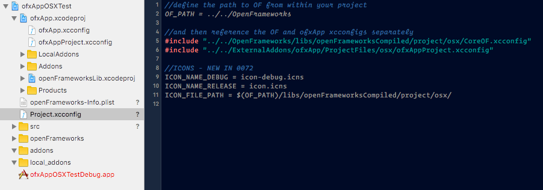
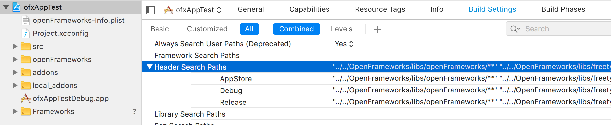
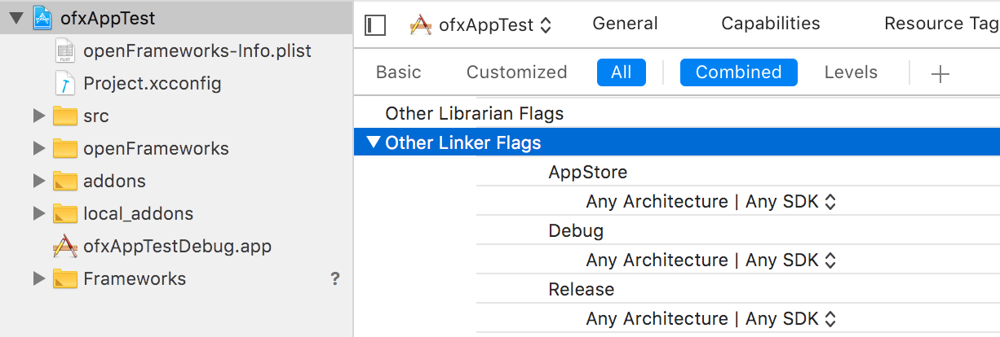
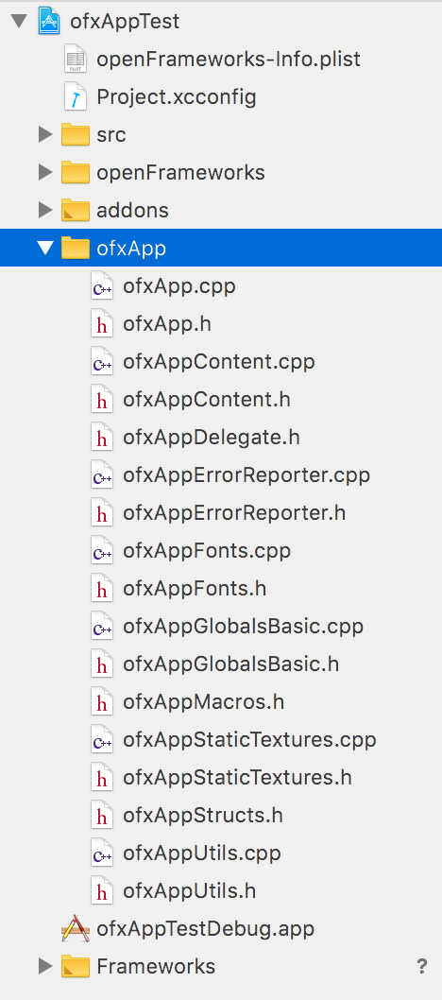

# Including ofxApp as a dependency

For LP-styled repos, where OF itself is setup as a git submodule and the External Addons also setup as git submodules in the `/ExternalAddons` folder, creating an ofxApp project can be made simpler;

***Note that this only works with this LP-style folder structure!***

This document describes how to do this in OF 10.1 style, where OF itself is not added as a subproject to your Xcode project anymore. This was forced by Xcode 10.0 not allowing the same project to be open multiple times, so it meant you could not have two projects open if they both used OpenFrameworks. The same pain applies to ofxApp, so it is not embedded inside your project anymore. If you need that, get an older revision tagged "pre-xcode-10".

Given the number of dependencies, you can alternatively include ofxApp as a Target Dependency instead of manually including all the required addons. The target dependency approach means ofxApp is included as a whole, with all its dependencies defined in an Xcode project file that is part of the addon repository. It also means you don't have to manually manage all the include paths, etc. This approach is the same one that OpenFrameworks uses; in your standard OF app, the Xcode Project includes the OF Xcode project as a target dependency.

The approach here is to do the same with ofxApp:

#### 1. Create an empty OF project with project generator

It should be at the right folder level, either in the "Sketches" folder, or the "Apps" folder at the root of your LP-Style OpenFrameworks repo.

#### 2. include `ofxAppProject.xcconfig` from your `Project.xcconfig`.

Following the same pattern that OF uses, open your `Project.xcconfig` and edit it so that it looks like this:

```c++
//define the path to OF from within your project
OF_PATH = ../../OpenFrameworks

//and then reference the OF and ofxApp xcconfigs separately
#include "../../OpenFrameworks/libs/openFrameworksCompiled/project/osx/CoreOF.xcconfig"
#include "../../ExternalAddons/ofxApp/ProjectFiles/osx/ofxAppProject.xcconfig"

//ICONS - NEW IN 0072
ICON_NAME_DEBUG = icon-debug.icns
ICON_NAME_RELEASE = icon.icns
ICON_FILE_PATH = $(OF_PATH)/libs/openFrameworksCompiled/project/osx/
```



Make sure it looks exactly like that, and there's nothing else but that in the `Project.xconfig` file.

Note that we are including the `ofxApp.xcconfig` from our project's xcconfig, which effectively adds all the `ofxApp` dependency includes to our project's. This is what saves us from having to define all include paths, etc. within our project, bc the `ofxApp` Xcode project already has these defined.

#### 3. Remove "Header Search Path" overrides

Navigate to the *"Build Settings"* tab, and look for *"Header Search Paths"*. If its content are rendered in bold type, it means it has been edited, and the edits are overriding the contents of your `Project.xcconfig` file. We don't want that.

Select it, and press `backspace` on your keyboard. This will remove these edits, and the field will be rendered in regular type.



#### 4. Remove "Other Linker Flags" overrides

Similar as the previous step. Navigate to the *"Build Settings"* tab, and look for *"Other Linker Flags"*. If its content are rendered in bold type, it means it has been edited, and the edits are overriding the contents of your `Project.xcconfig` file. We don't want that.

Select it, and press `backspace` on your keyboard. This will remove these edits, and the field will be rendered in regular type.



#### 5. include the ofxApp src within your project.

Because ofxApp holds globals that are unique per each project, it needs to be compiled together with your project. Because of that, `ofxApp` itself is not included in the ofxApp.xcodeproj; only its dependencies are.

So, to actually use ofxApp in your project, you need to add it into the project navigator inside your project.

This is as easy as creating a new group named `ofxApp` within the addons section in the *"Project Navigator"*, and dragging all the `ofxApp` src files in it.




#### 6. your project is ready to use ofxApp.

And more importantly, any new dependencies `ofxApp` might get in future updates, will be automatically handled when you update `ofxApp`, because the `ofxApp` project files are part of the `ofxApp` repo.

If you need to include more addons, just add them to your project as you normally would.
