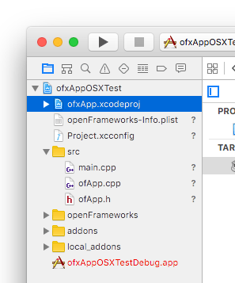
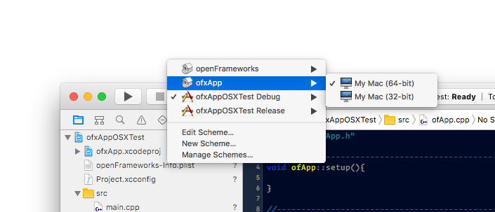
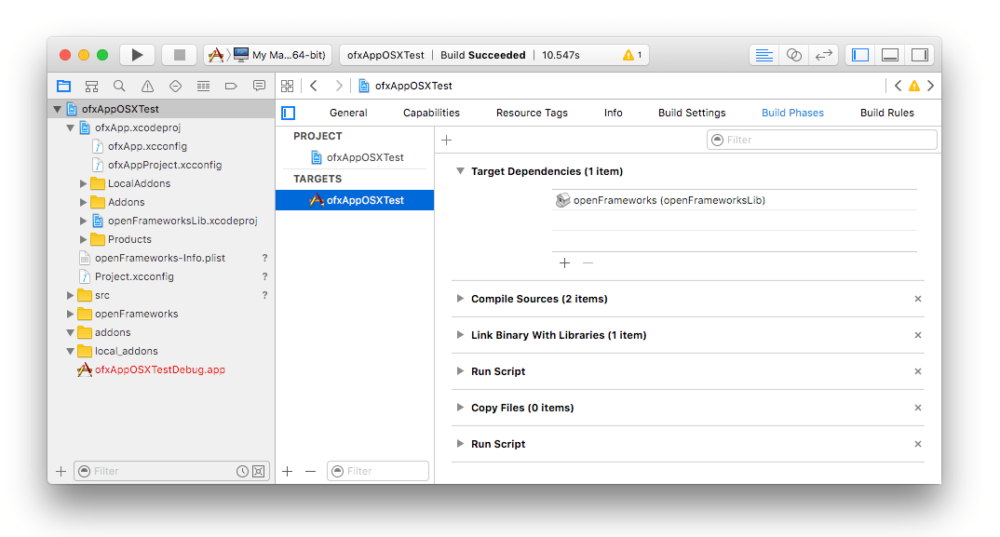
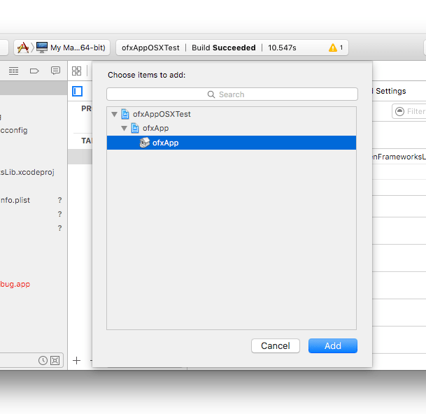
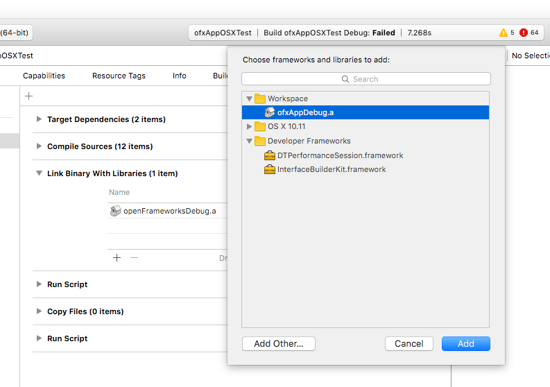

# Including ofxApp as a dependency

For LP-styled repos, where OF itself is setup as a git submodule and the External Addons also setup as git submodules in the `/ExternalAddons` folder, creating an ofxApp project can be made simpler;

***Note that this only works with this LP-style folder structure!***

Given the number of dependencies, you can alternatively include ofxApp as a Target Dependency instead of manually including all the required addons. The target dependency approach means ofxApp is included as a whole, with all its dependencies defined in an Xcode project file that is part of the addon repository. It also means you don't have to manually manage all the include paths, etc. This approach is the same one that OpenFrameworks uses; in your standard OF app, the Xcode Project includes the OF Xcode project as a target dependency.

The approach here is to do the same with ofxApp:

#### 1. Create an empty OF project with project generator

#### 2. add the ofxApp Xcode project file into your empty OF project

You can just drag the `ofxApp.xcodeproj` file from the Finder into the *"Project Navigator"*. The `ofxApp.xcodeproj` project file inside `ExternalAddons/ofxApp/ProjectFiles/osx/`.



#### 3. ofxApp is now included in your Project

At this point, your project will have a new Scheme named ofxApp, which you can compile independently from your project.



You should be able to target ofxApp and build it. But to be able to use ofxApp within your project, we need to change a couple other things first.

#### 4. include `ofxAppProject.xcconfig` from your `Project.xcconfig`.

Following the same pattern that OF uses, open your `Project.xcconfig` and edit it so that it looks like:

```c++
//define the path to OF from within your project
OF_PATH = ../../OpenFrameworks

//and then reference the OF and ofxApp xcconfigs separately
#include "../../OpenFrameworks/libs/openFrameworksCompiled/project/osx/CoreOF.xcconfig"
#include "../../ExternalAddons/ofxApp/ProjectFiles/osx/ofxAppProject.xcconfig"

```

Remove any references to `OTHER_CFLAGS`, `OTHER_LDFLAGS` or `HEADER_SEARCH_PATHS` overrides in your `Project.xcconfig` file.


#### 5. Add ofxApp as a target dependency of your projects

Select your Project from the *"Project Navigator"*, choose the app target and go to the `Build Phases` tab.



Then expand the *"Target Dependencies"* section, and click on the "+" button. A new panel opens, in which you can pick `ofxApp`. Select `ofxApp` and click *"add"*.



`ofxApp` should then show up listed as a *"Target Dependency"*, as well as OpenFrameworks. This makes Xcode understand that to build your app, it must first build OpenFrameworks and `ofxApp`.

#### 6. Link against the ofxApp project.

Select your Project from the *"Project Navigator"*, choose the app target and go to the `Build Phases` tab.

Then expand the *"Link Binary With Libraries"* section, and click on the "+" button. A new panel opens, in which you can pick `ofxAppDebug.a`. Select `ofxAppDebug.a` and click *"add"*.



`ofxAppDebug.a` should then show up listed as a *"Link Binary With Libraries"*, as well as OpenFrameworks. This makes Xcode link your project's source code with ofxApp's static lib.

#### 7. Remove "Header Search Path" overrides

Navigate to the *"Build Settings"* tab, and look for *"Header Search Paths"*. if its content are rendered in bold type, it means it has been edited, and the edits are overriding the contents of your `Project.xcconfig` file. We don't want that.

Select it, and press `backspace` on your keyboard. This will remove these edits, and the field will be rendered in regular type.


#### 7. your project is ready to use ofxApp.

And more importantly, any new dependencies ofxApp might get in future updates, will be automatically handled when you update ofxApp.

If you need to include more addons, just add them to your project as you normally would.
